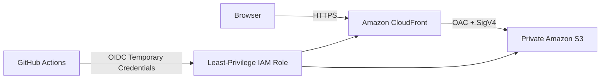
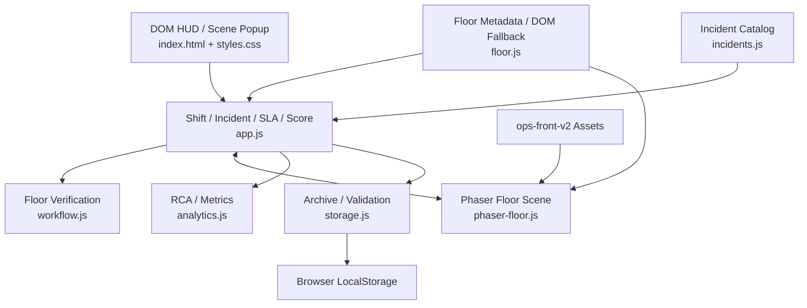

# DC OPS: NIGHT SHIFT — Project Status

최종 업데이트: **2026-08-09**

현재 Production 안정 버전:

```text
v1.0 — AWS Deployment & Portfolio Release
```

현재 개발 버전:

```text
v1.1 — Phaser-based Data Center Floor Mode Preview
```

현재 개발 Branch:

```text
feature/v1.1-floor-mode
```

현재 v1.1은 기존 Dashboard 중심 Incident Response Simulator를 **Scene-first Data Center Operations Game**으로 확장하는 단계입니다.

실제 Linux Shell, 실제 Monitoring System, Backend, Database 또는 운영 AWS Infrastructure와 연결되지 않으며, 모든 Incident와 Terminal Output은 Browser 내부에서 동작하는 안전한 Simulation입니다.

---

# 1. Version Status

## Production

```text
v1.0 Stable
```

v1.0은 실제 AWS Hosting과 배포 자동화까지 완료된 Portfolio Release입니다.

Live Demo:

https://d35scspd118fhn.cloudfront.net

현재 Production은 계속 v1.0을 유지합니다.

---

## Development

```text
v1.1 Floor Mode Preview
```

v1.1은 현재 다음 Branch에서 개발 중입니다.

```text
feature/v1.1-floor-mode
```

현재 GitHub Checkpoint:

```text
e297674
feat: checkpoint v1.1 phaser floor mode

7e6d703
feat: add floor diagnosis recovery verification flow
```

v1.1이 최종 검증되기 전까지 `main`과 Production v1.0은 유지합니다.

---

# 2. v1.0 완료 범위

v1.0에서 다음 기능을 구현했습니다.

- 검증된 Incident Scenario 15종
- SERVER / STORAGE / NETWORK / POWER / COOLING Category
- Easy / Normal / Hard Difficulty
- Priority 기반 Incident Queue
- Ticket별 SLA Timer
- SLA Breach 처리
- Allowlist 기반 Safe Simulated Terminal
- Incident별 Evidence 수집
- Hard Mode Evidence Gate
- Root Cause Diagnosis
- Recovery Action
- Wrong Diagnosis / Wrong Action Penalty
- Score System
- Incident History
- Timeline
- RCA
- Lessons Learned
- SLA Compliance
- MTTR
- Accuracy
- Investigation Coverage
- Category Performance
- LocalStorage 기반 Shift Archive
- Previous Shift Comparison
- Personal Best
- Archive 개별 삭제 / 전체 삭제
- LocalStorage Schema Validation
- Responsive Dashboard
- Automated Regression Test
- GitHub Actions CI
- AWS Static Hosting
- GitHub OIDC 기반 AWS Deployment

---

# 3. v1.0 AWS Architecture

Production Architecture:



구성:

- Amazon S3 Private Bucket
- Amazon CloudFront
- Origin Access Control
- HTTPS Redirect
- AWS CloudFormation
- GitHub Actions
- GitHub OIDC
- Least-Privilege IAM Deploy Role

장기 AWS Access Key는 GitHub에 저장하지 않습니다.

AWS는 Application Backend가 아니라 정적 Frontend Hosting 계층으로만 사용합니다.

---

# 4. v1.1 목표

v1.1의 핵심 목표는 기존 Dashboard 기반 Incident Simulator를 **직접 이동하고 조사하는 Data Center Operations Game**으로 확장하는 것입니다.

목표 Workflow:

```text
Incident
→ Floor 탐색
→ Rack 접근
→ Terminal
→ Evidence
→ Diagnosis
→ Recovery
→ Verification
→ Resolve
```

사용자가 장애를 해결하기 위해 기존 v1.0 Dashboard로 돌아갈 필요 없이 Floor Scene 안에서 전체 Incident Response Lifecycle을 완료하도록 만드는 것이 핵심입니다.

---

# 5. Phaser Floor Migration

초기 v1.1 Floor는 HTML / CSS Grid 기반으로 구현했습니다.

하지만 다음 문제가 있었습니다.

- Tile 단위 이동
- 이동이 끊겨 보임
- Visual Depth 표현 한계
- Equipment Collision 표현 한계
- Game Scene보다 Dashboard에 가까운 인상

이를 해결하기 위해 중앙 Floor Scene을 Phaser `3.90.0` Canvas로 Migration했습니다.

현재 Phaser Floor:

- Logical World `1440 × 640`
- Continuous Movement
- 4-direction Movement
- Player Speed `270`
- Key Release Stop
- Equipment Collision
- Room Boundary
- Rack Interaction
- `E` Interaction
- Y-depth
- Foot-based Player Physics
- DOM / Phaser State Bridge
- Legacy DOM Fallback

---

# 6. Floor Layout

현재 Floor에는 다음 Object가 배치됩니다.

```text
R01
R02
R03
R04
R05
R06
R07
R08
R09
R10

UPS

PDU-A
PDU-B

CRAC
```

현재 Incident Gameplay는 우선 R01~R06과 연결되어 있습니다.

R07~R10 및 Facility-specific Incident는 후속 개발 범위입니다.

---

# 7. Collision Architecture

Visual Sprite 크기와 실제 Collision Area를 분리했습니다.

Equipment 전체 이미지가 Collision Body가 되는 대신 실제 바닥 Footprint를 Collision 기준으로 사용합니다.

Player 또한 Character Sprite 전체가 아니라 Foot Position 중심의 작은 Physics Body를 사용합니다.

이를 통해:

- Rack 앞 통로 이동
- Equipment 사이 통과
- 자연스러운 Depth
- 인접 Interaction

을 처리합니다.

---

# 8. Visual Asset Pipeline

초기 Equipment Asset은 3/4 Perspective 형태였습니다.

Floor Scene은 정면 중심 구도였기 때문에 Rack과 Player의 시각적 방향이 서로 맞지 않는 문제가 있었습니다.

이를 해결하기 위해 새로운 Front-facing Asset Pack을 제작했습니다.

현재 활성 Visual Pack:

```text
ops-front-v2
```

포함 Asset:

## Rack

```text
rack-normal
rack-warning
rack-critical
```

## Equipment

```text
UPS
PDU-A
PDU-B
CRAC
```

## Operator

```text
idle-down
idle-up
idle-left
idle-right
```

각 방향별 Walk Animation:

```text
walk-1
walk-2
walk-3
walk-4
```

총 4-direction / 4-frame Walk 구조입니다.

---

# 9. Asset Generation

Source Sheet:

```text
assets/v1.1/source/
```

생성 결과:

```text
assets/v1.1/ops-front-v2/
```

Deterministic Asset Generation Script:

```text
scripts/build-ops-front-v2-assets.py
```

Source Sheet에서 지정된 영역을 Crop / Normalize하여 Asset Pack을 재생성할 수 있도록 구성했습니다.

Player LEFT 방향은 별도 PNG Asset으로 생성하여 Runtime `scaleX()` Mirroring에 의존하지 않습니다.

---

# 10. Scene-first UI Redesign

초기 Floor Mode에서는 다음 UI가 계속 화면에 표시되었습니다.

- Controls
- Operator Selector
- Persistent Terminal
- Mini Map
- Objectives
- Active Incident Column
- Bottom Dashboard

이 구조는 Game Scene 영역을 줄이고 화면을 복잡하게 만들었습니다.

이후 UI를 Scene-first 방식으로 변경했습니다.

제거 또는 축소:

- Persistent Controls Panel
- Operator Selector
- Persistent Terminal
- Mini Map
- Persistent Objectives
- Bottom Dashboard Row
- Permanent Incident Column

필요한 기능은 Popup으로 전환했습니다.

---

# 11. Scene Popup System

현재 관리되는 Scene Popup:

```text
none
terminal
objectives
incident
diagnosis
recovery
```

특징:

- Popup 한 개만 동시에 표시
- `ESC`로 닫기
- Popup Close 이후 Phaser Focus 복귀
- Terminal Focus 중 Player Input 차단
- Form Control 사용 중 Movement 차단

이를 통해 DOM UI와 Phaser Input 간 Keyboard Conflict를 줄였습니다.

---

# 12. Full-height Game Scene

초기 1920×1080 환경에서는 Floor Scene 아래에 큰 빈 공간이 발생했습니다.

원인:

- Permanent Incident Column
- 별도 Bottom Status 영역
- 기존 Dashboard Layout Height 구조

이를 정리하여 Floor Mode가 Viewport 높이를 최대한 사용하도록 변경했습니다.

1920×1080 기준 Scene Wrapper는 기존 약:

```text
1482 × 660
```

에서 약:

```text
1890 × 977
```

규모로 확장되었습니다.

Phaser Logical World는 계속:

```text
1440 × 640
```

을 유지합니다.

따라서 Gameplay Position, Collision, Interaction Coordinate를 변경하지 않고 Display Area만 확대했습니다.

---

# 13. Terminal Popup

Rack 근처에서 `E`를 누르면 해당 Rack의 Terminal Popup이 열립니다.

Terminal은 실제 Linux Shell이 아닌 **Safe Simulated Terminal**입니다.

지원 Command 예:

```text
help
top
ps aux
uptime
df -h
ping
curl
nslookup
systemctl
journalctl
ipmitool sensor
```

Command는 실제 OS에 전달되지 않습니다.

Incident Scenario에 정의된 Simulation Output을 반환합니다.

---

# 14. Rack별 Terminal History

Terminal Session은 Rack별로 독립적으로 유지됩니다.

예:

```text
R01
help
ping 127.0.0.1
systemctl status nginx
journalctl -u nginx
```

다른 Rack:

```text
R02
df -h
```

R01으로 다시 돌아오면 기존 R01 History가 유지됩니다.

---

# 15. Terminal Scroll Fix

기존 문제:

```text
R01에서 여러 명령 실행
→ R02 이동
→ 다시 R01
→ Terminal이 오래된 History 상단에서 열림
```

원인은 Hidden Popup 상태에서 History Render 직후 `scrollTop`을 변경하면서 실제 Layout Height가 아직 확정되지 않았기 때문이었습니다.

수정 후:

- Terminal Open
- Rack Switch
- History Restore
- New Command Output

시점에서 Layout이 완료된 이후 최신 Output으로 Scroll합니다.

일반 UI Heartbeat에서는 사용자가 직접 이동한 Scroll 위치를 보존합니다.

---

# 16. Terminal Input Isolation

Terminal Input에 Focus가 있을 때:

```text
Arrow Up / Down
Space
E
```

등의 입력이 Player Movement 또는 Floor Interaction으로 전달되지 않습니다.

`ESC`로 Terminal을 닫으면 Phaser Scene Focus가 복구됩니다.

---

# 17. Evidence System

Incident 조사 과정에서 특정 Command가 Evidence를 제공합니다.

예:

```text
EVIDENCE 0 / 2

ipmitool sensor
→ EVIDENCE 1 / 2

uptime
→ EVIDENCE 2 / 2
```

Hard Incident에서는 필요한 Evidence를 확보하기 전에는 Diagnosis를 진행할 수 없습니다.

Evidence 충족 후:

```text
[ 진단하기 ]
```

가 활성화됩니다.

---

# 18. Floor Diagnosis

기존 v1.0 Diagnosis Logic을 재사용해 Floor Scene 안에서 Diagnosis Popup을 사용할 수 있도록 연결했습니다.

표시 정보:

- Rack
- Ticket
- Symptom
- Collected Evidence
- Root Cause Options

Wrong Diagnosis:

- Incident Resolve 안 됨
- 기존 Penalty 적용
- 다시 조사 가능

Correct Diagnosis:

```text
Diagnosis
→ Recovery
```

단계로 진행합니다.

---

# 19. Floor Recovery

Diagnosis 성공 이후 Scene Popup에서 Recovery Action을 선택합니다.

기존 v1.0 Incident Scenario의 `actionOptions`를 재사용합니다.

Wrong Action:

- 기존 Penalty / Feedback 적용
- Incident 유지

Correct Action:

v1.0 Dashboard:

```text
Recovery
→ Resolve
```

v1.1 Floor Mode:

```text
Recovery
→ Verification Pending
```

으로 동작합니다.

---

# 20. Recovery Verification

v1.1 Floor Mode에서 추가된 핵심 Gameplay Stage입니다.

Recovery Action을 올바르게 선택해도 Incident를 즉시 종료하지 않습니다.

상태:

```text
RECOVERY APPLIED
VERIFICATION PENDING
```

이후 Terminal에서 정상 상태를 다시 확인해야 합니다.

---

# 21. Verification Browser Test

실제 Browser End-to-End 검증에 사용한 Scenario:

```text
Rack: R04
Category: POWER
Incident: Rack PDU Feed A Lost
```

Evidence:

```text
ipmitool sensor
uptime
```

Diagnosis:

```text
Rack PDU Feed A Lost
```

Recovery:

```text
Redundant Feed Recovery Action
```

Recovery 직후:

```text
VERIFICATION PENDING
```

관련 없는 Verification Command:

```text
uptime
```

결과:

```text
Pending 유지
```

필수 Verification Command:

```text
ipmitool sensor
```

정상 상태 확인 후:

```text
VERIFICATION PASSED
INCIDENT RESOLVED
```

---

# 22. Verification Resolve Result

Verification 성공 이후 Browser에서 확인한 결과:

```text
Active Incident
1 → 0
```

Rack:

```text
Critical / Incident
→ Healthy
```

Score:

```text
+156
```

그 외:

- Incident History 생성
- Terminal History 유지
- Evidence 기록 유지
- SLA 기록
- MTTR 기록
- Rack State 정상화

를 확인했습니다.

수동 Browser Test 시간이 HARD SLA 30초를 넘었기 때문에 해당 Incident는 정상적으로:

```text
SLA BREACHED
```

로 기록되었습니다.

---

# 23. Verification Architecture

현재 Floor Verification Logic은 다음 File로 분리했습니다.

```text
workflow.js
```

현재 Verification State는 기존 Incident의 Useful / Evidence Command 정보를 이용해 생성합니다.

현재 한계:

```text
첫 번째 유효 Evidence Command를
필수 Verification Command로 사용
```

이 구조는 초기 v1.1 Workflow 구현을 위한 최소 구현입니다.

향후에는 Incident별 명시적 Verification Rule을 정의할 예정입니다.

예:

```text
SERVER / Nginx

systemctl status nginx
curl localhost
```

```text
STORAGE

df -h
```

```text
POWER

ipmitool sensor
```

```text
DNS

nslookup
dig
```

---

# 24. Dashboard Compatibility

기존 v1.0 Dashboard Logic은 유지합니다.

기존 Dashboard:

```text
Evidence
→ Diagnosis
→ Recovery
→ Immediate Resolve
```

Floor Mode:

```text
Evidence
→ Diagnosis
→ Recovery
→ Verification
→ Resolve
```

Verification Gate는 Floor Mode에만 적용하여 기존 v1.0 Workflow와의 호환성을 유지했습니다.

---

# 25. Incident Metrics

현재 기록하는 주요 지표:

- Score
- SLA Compliance
- MTTR
- Diagnosis Accuracy
- Investigation Coverage
- Category Performance
- Wrong Diagnosis
- Wrong Recovery
- Incident History
- RCA
- Lessons Learned

---

# 26. Shift Archive

완료된 Shift는 Browser LocalStorage에 저장됩니다.

지원 기능:

- Shift History
- Filter
- Previous Shift Comparison
- Personal Best
- Archive 개별 삭제
- Archive 전체 삭제
- 최대 Record 제한
- Schema Validation
- Corruption Fallback

---

# 27. Automated Tests

현재 v1.1 Branch Automated Regression Result:

```text
59 passed
```

실행:

```bash
npm run check
npm test
```

최근 결과:

```text
Package Check: PASS
Automated Tests: 59 passed
git diff --check: PASS
Browser Console Errors: 0
Broken Images: 0
```

---

# 28. Automated Test Coverage

주요 Test 범위:

- Incident Catalog
- Difficulty Pool
- Score Calculation
- SLA
- Terminal Command Classification
- Evidence Collection
- Diagnosis
- Recovery
- Verification State
- Verification Command
- Incident Resolve
- Incident History
- RCA
- LocalStorage Validation
- Archive CRUD
- Previous Shift Comparison
- Personal Best
- Floor Metadata
- Movement Intent
- Collision Metadata
- Depth Metadata
- Rack Interaction
- Terminal Session History
- Dashboard Compatibility
- DOM Fallback

---

# 29. Browser Regression Status

최근 Desktop Browser Test:

```text
Viewport
1920 × 1080
```

확인:

- Phaser Canvas 정상
- Player Movement 정상
- Collision 정상
- `E` Rack Interaction 정상
- Terminal Popup 정상
- Terminal History 정상
- Terminal Scroll 정상
- Space 입력 정상
- Arrow / E Focus Isolation 정상
- Objectives Popup 정상
- Incident Popup 정상
- Diagnosis Popup 정상
- Recovery Popup 정상
- Verification 정상
- Score 정상
- SLA 정상
- History 정상
- Console Error 0
- Broken Image 0

---

# 30. Responsive Status

확인한 Viewport:

```text
1920 × 1080
1440 × 1000
375 × 812
```

Desktop에서는 Scene이 Viewport 대부분을 사용합니다.

Mobile에서는 Phaser Logical World Aspect Ratio를 유지하여 Fit되지만 Touch Movement는 아직 제공하지 않습니다.

Tall Viewport에서는 Logical World Aspect Ratio 때문에 Letterboxing이 발생할 수 있습니다.

---

# 31. Project Architecture



---

# 32. Source of Truth

Application State의 Source of Truth는 계속:

```text
app.js
```

입니다.

`phaser-floor.js`는 주로 다음 역할을 담당합니다.

- Rendering
- Player Movement
- Animation
- Collision
- Depth
- Proximity
- E Interaction

`workflow.js`:

- Floor Verification State
- Verification Command Completion

기존 Business / Incident Logic을 Phaser 내부에 중복 작성하지 않는 것을 원칙으로 합니다.

---

# 33. Project Structure

```text
dc-ops-simulator/
│
├── .github/
│   └── workflows/
│       ├── ci.yml
│       └── deploy.yml
│
├── assets/
│   └── v1.1/
│       ├── environment/
│       ├── equipment/
│       ├── operators/
│       ├── racks/
│       ├── source/
│       └── ops-front-v2/
│
├── docs/
│   └── DEPLOYMENT.md
│
├── infra/
│   ├── cloudformation.yml
│   └── github-oidc.yml
│
├── scripts/
│   ├── vendor-phaser.js
│   └── build-ops-front-v2-assets.py
│
├── tests/
│   └── run-tests.js
│
├── vendor/
│   ├── phaser.min.js
│   └── PHASER_LICENSE.md
│
├── analytics.js
├── app.js
├── floor.js
├── incidents.js
├── phaser-floor.js
├── workflow.js
├── storage.js
│
├── index.html
├── styles.css
│
├── package.json
├── package-lock.json
│
├── README.md
├── PROJECT_STATUS.md
└── THIRD_PARTY_NOTICES.md
```

---

# 34. Current Limitations

현재 알려진 주요 제한:

- 실제 Linux Shell이 아님
- 실제 Monitoring System과 연결되지 않음
- 실제 Server / Network / Storage Device와 연결되지 않음
- Backend 없음
- Database Server 없음
- 실행 중 Shift는 Refresh 후 복원되지 않음
- Archive는 Browser LocalStorage에 저장
- 기기 간 Archive Sync 없음
- R07~R10 Gameplay 확장 필요
- UPS / PDU / CRAC Facility Incident 확장 필요
- Verification Rule이 아직 최소 구현
- Incident별 다중 Verification Command 필요
- Mobile Touch Movement 없음
- Tall Viewport Letterboxing 가능
- v1.1 Production Deploy 미수행

---

# 35. Next Development Tasks

우선순위:

## Gameplay

- Incident별 명시적 Verification Rule
- R07~R10 Incident 연동
- UPS / PDU / CRAC Facility Incident
- Terminal Command Simulation 확대
- Scenario별 Post-Recovery Output 개선

## Visual

- Environment Polish
- Lighting
- Shadow
- Equipment Placement 최종 조정
- Letterboxing / Camera Composition 검토

## UX

- Incident Workflow Guide 개선
- Popup Polish
- Mobile Touch Interaction 검토

## Quality

- 전체 v1.1 Regression
- Browser Cross-check
- Documentation 최신화
- Final README 검토
- Development Log 정리

## Release

```text
feature/v1.1-floor-mode
→ Pull Request
→ main
→ v1.1 Production Deployment
```

---

# 36. Git Strategy

현재:

```text
main
└─ v1.0 Stable
```

Development:

```text
feature/v1.1-floor-mode
```

현재 주요 Checkpoint:

```text
e297674
Phaser Floor / ops-front-v2 / Scene UI

7e6d703
Evidence → Diagnosis → Recovery → Verification
```

v1.1 개발이 완료되기 전까지 `main`은 변경하지 않습니다.

최종 v1.1 검증 후 Pull Request를 통해 `main`으로 Merge합니다.

---

# 37. Production Deployment Policy

현재 v1.1은 Local / Development Branch Preview입니다.

Production은 계속:

```text
v1.0
```

입니다.

v1.1이 최종 검증되기 전에는 AWS Production Artifact를 변경하지 않습니다.

Release 단계에서 다음을 별도로 검토합니다.

- Deploy Artifact
- GitHub Actions
- S3 Sync File
- CloudFront Cache
- Production Regression
- Rollback

---

# 38. Security Scope

Repository에 다음 정보를 기록하지 않습니다.

- AWS Account ID
- Secret Access Key
- Session Token
- Private Credential
- Sensitive Environment Value

AWS Deployment는 GitHub OIDC Temporary Credential 기반입니다.

---

# 39. Simulation Scope

본 프로젝트의 Terminal은 운영 Command 학습을 위한 Simulation입니다.

예:

```text
systemctl status nginx
journalctl -u nginx
df -h
ping
curl
nslookup
ipmitool sensor
```

실제 Command는 실행되지 않습니다.

Simulation은 Incident Scenario와 연결된 Output을 반환합니다.

본 프로젝트의 목적은 실제 Infrastructure를 제어하는 것이 아니라 다음 Process를 연습하는 것입니다.

```text
Observe
→ Investigate
→ Collect Evidence
→ Diagnose
→ Recover
→ Verify
→ Document
```

---

# 40. Current Milestone

현재 v1.1에서 달성한 가장 중요한 Milestone:

```text
사용자가 Data Center Floor를 직접 이동
        ↓
장애 Rack 발견
        ↓
E로 Terminal 진입
        ↓
Linux-style Command로 Evidence 수집
        ↓
Root Cause Diagnosis
        ↓
Recovery Action
        ↓
Terminal Verification
        ↓
Incident Resolve
```

즉, 기존 Dashboard 중심 Simulator에서 **직접 이동하고 조사하며 장애 대응 Lifecycle을 완료하는 Game-oriented Incident Response Simulator**로 전환하는 핵심 구조가 구현된 상태입니다.

---

# 41. Latest Validation

최근 확인 결과:

```text
Branch:
feature/v1.1-floor-mode

Automated Tests:
59 passed

Browser Console:
0 errors

Broken Images:
0

PLAYER_SPEED:
270

APP_VERSION:
v1.0

UI:
V1.1 PREVIEW

Commit:
7e6d703
```

Commit / Push / Deploy는 기능 구현 단계와 Documentation 단계에서 별도로 관리합니다.

---

# 42. Release Status

```text
v1.0
STATUS: PRODUCTION / STABLE

v1.1
STATUS: DEVELOPMENT / PREVIEW
```

v1.1은 아직 Production Release가 아닙니다.

최종 Gameplay, Visual Polish, Regression과 Documentation이 완료된 이후 Release 여부를 결정합니다.