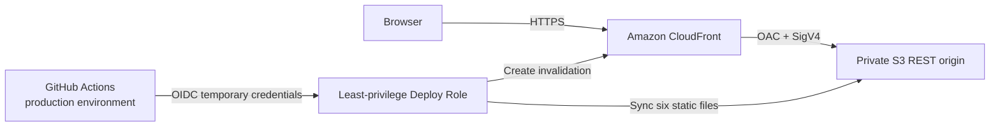

# DC OPS: NIGHT SHIFT — Project Status

최종 업데이트: 2026-08-09
현재 안정 버전: **v1.0 — AWS Deployment & Portfolio Release**

현재 개발 상태: **v1.1 — 2D Data Center Floor Mode (planning + scaffold, unreleased)**

Backend, build service 또는 CDN runtime 없이 브라우저에서 실행되는 데이터센터 Incident 대응 학습용 Simulator다. v1.1 preview는 exact dependency `phaser@3.90.0`의 browser build를 repository에 vendor한다. 실제 Linux Shell, 운영 Monitoring System, backend, database 또는 AWS API와 연결되지 않는다. AWS는 정적 Frontend를 전달하는 Hosting 계층으로만 사용한다.

## 1. v1.0 목표와 결과

v1.0에서는 v0.10의 기능 범위를 유지하면서 실제 공개 Hosting과 배포 자동화, 보안 검증을 완료했다.

- Seoul Region(`ap-northeast-2`)에 Private S3 + CloudFront + OAC 구성
- CloudFormation으로 Application Stack과 GitHub OIDC Stack 관리
- GitHub `production` Environment와 `main` branch rule 적용
- immutable exact OIDC subject와 `StringEquals` Trust Policy 적용
- 최소 권한 Deploy Role을 통한 `workflow_dispatch` 배포
- Node.js 24 syntax check와 36 automated checks 통과 후에만 배포
- CloudFront cache invalidation과 공개 endpoint Smoke Test 자동화
- Desktop Incident Response workflow와 375×812 hosted layout 검증
- README Live Demo와 실제 배포 Architecture 반영

Live Demo: [https://d35scspd118fhn.cloudfront.net](https://d35scspd118fhn.cloudfront.net)

## 2. Application 기능 상태

구현 완료:

- 검증된 Incident Scenario 15종
- `SERVER`, `STORAGE`, `NETWORK`, `POWER`, `COOLING` 5개 Category
- Easy / Normal / Hard Difficulty
- Incident Queue, Ticket별 SLA Timer와 SLA breach
- Allowlist 기반 Safe Simulated Terminal과 Evidence 수집
- Hard Mode Investigation Evidence Gate
- Diagnosis, Root Cause, Recovery Action과 Score 처리
- Incident History, Timeline, RCA, Lessons Learned
- SLA Compliance, MTTR, Accuracy, Category Performance
- LocalStorage 기반 Shift Archive, Filter, Previous Shift Comparison, Personal Best
- Archive 개별 삭제, 전체 삭제와 최대 50개 제한
- Modal focus, Escape, scroll lock과 Responsive layout

v1.1 scaffold 구현:

- R01~R10, UPS / PDU-A / PDU-B / CRAC를 표시하는 12×8 2D Floor
- player position/facing state와 방향키 이동
- 화면 경계 및 Rack·설비 tile 충돌
- 인접 asset 판정과 E 상호작용
- R01~R06을 기존 Rack selection, Terminal, Investigation 흐름에 연결
- R07~R10과 설비 상호작용은 `PLANNED` placeholder로 분리
- 저작권 자산이 없는 오리지널 Operator 선택 UI
- 한국어/English dictionary와 v1.1 핵심 UI 언어 전환
- wall panel, lighting, exit door, floor tile·panel, aisle grate, cable run과 equipment contact shadow를 포함한 reference-driven scene-first room 구성
- `assets/environment/`의 room shell, floor surface, grate, hazard stripe, exit door와 wall light original SVG
- `assets/v1.1/environment/room-shell-main.png` Environment Clean Plate를 1440×640 logical scene background로 적용
- `assets/equipment/`의 상태별 Rack과 display·breaker·fan grille를 갖춘 UPS/PDU/CRAC original SVG
- 동일한 `64×80` viewBox와 foot anchor를 공유하는 4-direction idle 및 방향별 2-frame walk Operator sprite 12개
- 총 25개 file 기반 SVG game asset, load-failure 시 procedural scene/equipment/player placeholder fallback
- keyboard key 형태의 Controls, console형 Investigation Terminal, facility state를 구분하는 Data Center mini map과 고밀도 Active Incident HUD
- 기본 Floor 화면에서 메뉴로 기존 v1.0 Dashboard와 Rack/Queue/Action/Event Log를 다시 펼칠 수 있음
- PHASE 1에서 중앙 Floor Scene만 Phaser 3.90.0 Canvas로 migration하고 상단/우측/하단 HUD 및 기존 Dashboard는 DOM으로 유지
- `app.js`는 Shift, Incident, SLA, Score, Terminal, Diagnosis, Recovery, Archive와 Analytics의 source of truth를 계속 담당
- `app.js → Phaser` Rack/Incident/Operator/언어/Shift state와 `Phaser → app.js` player position/nearby asset/E interaction callback으로 구성한 최소 bridge
- held key 기반 continuous movement, 4-direction only animation, 단일 `PLAYER_SPEED`와 key release stop
- equipment 전체 외형이 아닌 floor footprint collision body, room boundary와 foot-centered player physics body
- asset별 collision/interaction metadata와 foot-centered player physics body를 분리하고 `?debugFloor=1` overlay 제공
- equipment와 player에 floor contact `footY` 기반 depth 적용
- Phaser의 실제 continuous player 좌표를 DOM mini map marker에 반영
- Terminal 또는 form control focus와 Modal/legacy Dashboard 상태에서는 Phaser input을 차단
- Phaser 또는 SVG load 실패 시 legacy DOM Floor를 유지하며 `?floorRenderer=dom`으로 fallback 회귀 테스트 가능
- Phaser `3.90.0` exact npm dependency, local `vendor/phaser.min.js`, MIT license 원문과 third-party attribution 포함

## 3. AWS Architecture

Application Stack `dc-ops-night-shift-prod`:

- Private S3 Bucket
- S3 Bucket Policy
- CloudFront Distribution
- CloudFront Origin Access Control
- CloudFront Cache Policy

OIDC Stack `dc-ops-github-oidc`:

- GitHub Actions OIDC Provider
- 최소 권한 IAM Deploy Role과 inline policy

Account ID, Role ARN, Bucket 이름과 Distribution ID는 repository에 기록하지 않는다.

## 4. AWS Security 검증

- S3 Block Public Access 4개 설정 모두 활성화
- Object Ownership `BucketOwnerEnforced`
- S3 Website Hosting 비활성화
- S3 object 직접 요청 403 확인
- Bucket Policy에 public principal 없음
- CloudFront service principal만 대상 Distribution 조건으로 `s3:GetObject` 허용
- CloudFront S3 REST origin과 OAC 연결
- OAC `SigningBehavior: always`, `SigningProtocol: sigv4`
- Viewer Protocol Policy `redirect-to-https`
- CloudFront 허용 method `GET`, `HEAD`
- GitHub OIDC audience `sts.amazonaws.com`
- Trust Policy는 immutable exact subject에 `StringEquals` 사용
- subject wildcard 없음
- Deploy Role managed policy 0개, AdministratorAccess 없음
- 권한은 대상 Bucket의 list/get/put/delete와 대상 Distribution의 invalidation으로 제한
- GitHub에 장기 AWS Access Key, Secret Access Key 또는 Session Token 저장 안 함

## 5. GitHub Actions

### CI

`.github/workflows/ci.yml`은 `main` push와 Pull Request에서 실행된다.

1. Node.js 24 설정
2. JavaScript syntax check
3. 36 automated checks

### Deploy

`.github/workflows/deploy.yml`은 `workflow_dispatch`만 지원하며 `main`이 아니면 deploy job을 실행하지 않는다.

1. JavaScript syntax check
2. 36 automated checks
3. GitHub Environment variable 검증
4. GitHub OIDC token으로 `AssumeRoleWithWebIdentity`
5. 임시 AWS credential 발급
6. Private S3에 6개 정적 파일 sync
7. CloudFront `/*` invalidation
8. HTTPS endpoint와 `DC OPS: NIGHT SHIFT` marker Smoke Test

Smoke Test는 HTTP 요청 결과를 임시 파일에 저장한 뒤 content marker를 별도로 검사한다. `pipefail` 환경에서 `curl | grep --quiet`가 발생시키던 curl exit code 23 false negative를 제거했다.

## 6. Automated Tests

`tests/run-tests.js`는 Node.js built-in module을 사용하며 현재 v1.1 branch에서 **50개 check**를 포함한다.

- Incident Catalog validation과 Category/Difficulty pool
- MTTR, History filter와 Category Analytics
- Score multiplier와 최저 0점 정책
- Terminal utility/investigation/invalid 분류
- Full-Rack warning deduplication
- RCA와 Operator Summary
- Archive schema/corruption/future-schema 처리
- Shift Snapshot, ID, CRUD, filter/sort와 최대 50개 제한
- Previous Shift Comparison과 Personal Best
- 2D Floor asset 구성, 경계·충돌 이동과 인접 상호작용
- Phaser Floor 4방향 movement intent, 12개 Operator animation texture 계약, asset별 collision/interaction metadata, footY depth와 continuous mini map mapping

최종 로컬 결과: **50 passed, 0 failed**

## 7. Public Endpoint 검증

확인 완료:

- CloudFront HTTPS root 200
- HTTP 요청의 HTTPS 301 redirect
- `index.html`, `styles.css`, `app.js`, `incidents.js`, `analytics.js`, `storage.js` 각각 200
- HTML에서 `DC OPS: NIGHT SHIFT` marker 확인
- S3 REST URL 직접 접근 403
- Browser console error 0

## 8. Browser Smoke Test

실제 CloudFront URL에서 다음 workflow를 확인했다.

- START SHIFT와 수동/자동 Incident 생성
- Rack과 Incident Queue 선택
- Safe Simulated Terminal에서 `nslookup` 실행
- Evidence captured 표시
- 올바른 Diagnosis와 Root Cause 공개
- 올바른 Recovery Action과 Score 반영
- Incident History의 Timeline, RCA와 Terminal Evidence
- END SHIFT confirmation과 Shift Report
- Shift Archive 저장
- 새로고침 후 Archive count와 저장 record 유지

브라우저 storage 자체를 직접 조회하지 않고 UI에서 저장 전후와 새로고침 후 record를 확인했다.

## 9. 375px Hosted 검증

실제 CloudFront 환경에서 375×812 viewport로 확인했다.

- Dashboard와 Shift controls
- Rack/Incident/Terminal 하단 영역
- Incident History modal
- Shift Archive modal과 상세 record
- 수평 overflow 없음
- viewport 밖으로 벗어난 visible element 없음
- 의도하지 않은 text clipping 없음
- console error 0

### v1.1 PHASE 1 Local Browser 검증

- Phaser 3.90.0 Canvas renderer `ready`, 중앙 scene canvas 1개 확인
- 10초 지속 방향 입력에서 world boundary 밖으로 이동하지 않고 key release 후 좌표가 정지하는지 확인
- R06 Rack floor footprint 앞에서 collision 및 인접 상태 유지 확인
- E interaction으로 R06이 기존 Rack selection 및 Safe Simulated Terminal에 연결되는지 확인
- Terminal focus 중 Arrow key와 E가 player movement/interaction을 발생시키지 않는지 확인
- English toggle과 Luna Operator 선택이 DOM HUD와 Phaser bridge state에 반영되는지 확인
- Incident 생성 시 실제 Rack SVG가 critical state로 바뀌고 warning marker가 표시되는지 확인
- 1440×900에서 scene/HUD 구성과 수평 overflow 없음 확인
- 375×812에서 Phaser Canvas fit, 수평 overflow 없음 확인
- clean reload 이후 Phaser asset warning 및 console error 0
- `?floorRenderer=dom`에서 Canvas 0개, legacy DOM asset 14개 표시 확인
- reference와 비교해 중앙 Rack 2열, 좌측 전원 설비, 우측 CRAC, scene-first HUD 비율을 유지했으며 고해상도 sprite polish와 mobile touch UX는 후속 범위로 남김

## 10. Known Issues / Limitations

- 실행 중인 Shift는 페이지 새로고침 후 복구되지 않는다.
- Archive는 현재 Browser Profile과 Origin의 LocalStorage 범위이며 기기 간 동기화되지 않는다.
- Storage schema v1 validation은 있지만 migration runner는 없다.
- Archive import/export, cloud sync, pagination, 검색과 장기 trend chart가 없다.
- Terminal은 allowlist 기반 Simulation이며 실제 Shell, permission, pipe, redirect와 전체 option을 구현하지 않는다.
- DNS/network/process/hardware output은 교육용 Simulation이다.
- Background Tab에서는 render timer가 일시 중지될 수 있다. elapsed time 계산은 `Date.now()` 기준이다.
- Incident 간격, SLA, penalty와 grade는 추가 playtest를 통한 tuning 여지가 있다.
- Custom Domain, Route 53, ACM Certificate, WAF는 구성하지 않았다.
- CloudFront와 S3 요청, 저장 용량, data transfer와 invalidation 사용량에 따라 AWS 비용이 발생할 수 있다.
- R07~R10과 UPS / PDU-A / PDU-B / CRAC는 Floor 표시 및 근접 판정만 구현된 placeholder다.
- v1.1 언어 전환은 새 Floor 핵심 문자열에만 적용되며 기존 v1.0 UI 전체를 번역하지 않는다.
- Operator 선택은 player label과 시각적 선택 상태만 변경하며 gameplay 차이는 없다.
- v1.1 `assets/` directory는 아직 v1.0 production deploy artifact 복사 범위에 포함되지 않는다. Release 승인 전에는 Workflow를 변경하지 않으며 v1.1 preview는 local development branch에서만 검증한다.
- Phaser PHASE 1은 keyboard 기반 Desktop 우선 구현이다. 375×812에서 수평 overflow는 없지만 Canvas가 폭에 맞춰 축소되며 touch control은 아직 없다.

## 11. Data Safety

- LocalStorage unavailable, corrupted JSON, unsupported schema와 손상 record를 안전한 fallback으로 처리
- Archive 저장 실패가 Shift Report나 현재 게임을 중단하지 않음
- API key, password, credential, Account ID와 개인 PC 절대경로를 source에 저장하지 않음
- `.env*`, `node_modules/`와 OS metadata를 Git에서 제외

## 12. Version History

- `v0.7` — Expanded Incident Catalog & Category System
- `v0.8` — Incident History & RCA Analytics System
- `v0.9` — Persistent Shift Archive & Operations Records
- `v0.10` — Production Readiness & Portfolio Polish
- `v1.0` — AWS Deployment & Portfolio Release
- `v1.1` — 2D Data Center Floor Mode (planning + scaffold, unreleased)

## 13. 다음 개선 후보

- R07~R10 및 UPS / PDU-A / PDU-B / CRAC 상호작용 Scenario 연결
- Floor mode keyboard 접근성, mobile layout과 gameplay playtest
- playtest 기반 SLA, Incident interval, score와 grade tuning
- Archive 검색, pagination과 import/export
- README Operator Walkthrough와 release screenshot 보강
- Custom Domain은 비용과 운영 범위를 별도로 검토한 뒤 진행
