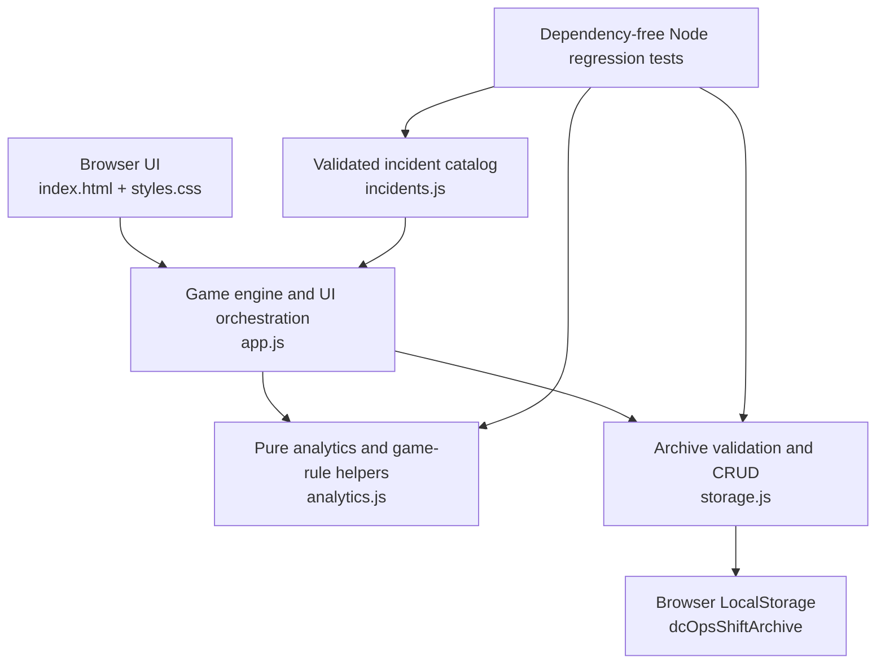

# DC OPS: NIGHT SHIFT

**DC OPS: NIGHT SHIFT** is a browser-based data center incident response simulator. It presents a timed night shift in which an operator investigates rack alerts, gathers terminal evidence, selects a diagnosis, performs a recovery action, and reviews the resulting SLA, MTTR, RCA, and shift records.

The project is an educational simulation. It does not connect to live infrastructure, execute shell commands, or replace production monitoring and incident-management tools.

## Overview

The simulator turns a familiar operations workflow into a compact, replayable browser experience:

1. Start an Easy, Normal, or Hard shift.
2. Triage manually or automatically generated incidents in the queue.
3. Select the affected rack and investigate it through a safe simulated terminal.
4. Confirm the diagnosis and recovery action.
5. Resolve the incident before its SLA expires.
6. Review incident history, evidence, timelines, RCA, category analytics, and the persistent shift archive.

## Why I Built This

Data center operations combines technical investigation with prioritization, evidence collection, and time pressure. This project demonstrates those relationships in a self-contained portfolio application while keeping its scope honest: the terminal and infrastructure are deterministic simulations, but the operational concepts and review flow are modeled explicitly.

## Core Gameplay / Workflow

```text
Incident → Investigation → Evidence → Diagnosis → Recovery
        → SLA / MTTR → Incident History / RCA → Shift Archive
```

Hard mode requires enough distinct useful evidence before diagnosis is unlocked. Easy and Normal keep investigation optional while still recording useful, invalid, and operational command statistics.

## Features

- 15 validated incident scenarios
- Five operational categories: Server, Storage, Network, Power, and Cooling
- Easy, Normal, and Hard difficulty profiles
- Priority-sorted incident queue and per-ticket SLA timers
- Allowlist-based simulated Linux terminal with incident-specific evidence
- Evidence gate for Hard-mode diagnosis
- Diagnosis and recovery decision flow with score penalties
- Non-negative score model with difficulty-based recovery rewards
- Incident History with terminal evidence, timeline, RCA, and lessons learned
- Shift analytics for SLA compliance, MTTR, accuracy, investigation coverage, and category performance
- Persistent LocalStorage Shift Archive with filters, comparisons, personal bests, and record deletion
- Dependency-free automated regression tests
- GitHub Actions syntax and test validation
- Responsive layout tested at a 375 px mobile viewport

## Incident Categories

| Category | Example focus |
| --- | --- |
| `SERVER` | Service, CPU, memory, and process health |
| `STORAGE` | Capacity, I/O, mount, and filesystem symptoms |
| `NETWORK` | Connectivity, DNS, interface, and packet-path symptoms |
| `POWER` | PSU, voltage, and redundant power symptoms |
| `COOLING` | Temperature, airflow, fan, and cooling symptoms |

## Architecture



There is no backend, database server, AWS service, or live shell in the current version.

## Project Structure

```text
dc-ops-simulator/
├── .github/
│   └── workflows/
│       └── ci.yml
├── tests/
│   └── run-tests.js
├── .gitattributes
├── .gitignore
├── analytics.js
├── app.js
├── incidents.js
├── index.html
├── package.json
├── PROJECT_STATUS.md
├── README.md
├── storage.js
└── styles.css
```

## Testing

The test runner uses only Node.js built-in modules. No package installation is required.
Node.js 20 or newer is recommended for local test execution; the browser application itself does not require Node.js.

```bash
npm test
npm run check
```

`npm test` covers the incident catalog, difficulty pools, score rules, terminal command classification, full-rack warning deduplication, RCA, investigation coverage, analytics, archive schema and CRUD, shift comparison, personal bests, and archive regressions. `npm run check` performs JavaScript syntax checks on the runtime and test files.

GitHub Actions runs both checks on pushes to `main` and on pull requests.

## Run Locally

The application has no build step and can be opened directly from `index.html`. For consistent browser storage and security behavior, serving the directory over localhost is recommended:

```bash
python -m http.server 8000
```

Then open `http://localhost:8000`.

Direct `file://` use also works in common desktop browsers, but LocalStorage behavior for local files can vary by browser and privacy policy. Archive records are local to the current browser profile and origin.

## Tech Stack

- Semantic HTML
- Responsive CSS
- Vanilla JavaScript
- Browser LocalStorage
- Node.js built-in modules for tests
- GitHub Actions

## Simulation Scope

The terminal accepts a fixed allowlist of investigation commands such as `top`, `df -h`, `ping`, `curl`, `nslookup`, `systemctl status nginx`, and `ipmitool sensor`. Commands return safe simulated output; they are never passed to an operating system.

Target-bearing commands display the requested target, but the simulator does not implement a real DNS resolver, network stack, process table, permissions model, pipes, redirection, or arbitrary shell options. Incident-specific evidence is designed for learning the investigation flow rather than reproducing every Linux behavior.

## Current Limitations

- A running shift is not restored after a page refresh.
- Archived shifts remain in one browser profile and do not sync across devices.
- Storage schema v1 has validation but no migration runner yet.
- Archive import/export, cloud sync, pagination, search, and trend charts are not implemented.
- Background-tab rendering may pause, although elapsed-time calculations use timestamps.
- Incident timing and scoring still benefit from broader playtesting.

## Roadmap

### v1.0 — AWS Deployment & Portfolio Release

- Publish the static application through an AWS-hosted portfolio environment.
- Document deployment, cache, rollback, and validation procedures.
- Add release screenshots and a concise operator walkthrough.
- Keep the live build static unless a backend has a clearly defined operational purpose.

Future learning work may document separate Ubuntu or EC2 labs. Those labs would remain distinct from this browser simulation.

## Repository / Development

Major milestones:

- `v0.7` — Expanded Incident Catalog & Category System
- `v0.8` — Incident History & RCA Analytics System
- `v0.9` — Persistent Shift Archive & Operations Records
- `v0.10` — Production Readiness & Portfolio Polish

Detailed implementation status, validation notes, and known limitations are maintained in [`PROJECT_STATUS.md`](PROJECT_STATUS.md).
