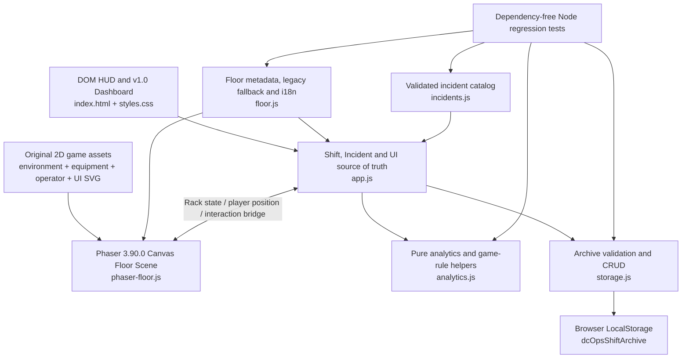
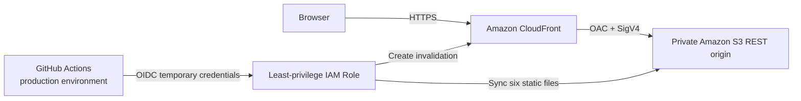

# DC OPS: NIGHT SHIFT

**DC OPS: NIGHT SHIFT**는 데이터센터 운영과 장애 대응 흐름을 학습하기 위한 브라우저 기반 **Incident Response Simulator**입니다.

제한된 시간의 Night Shift 동안 Rack에서 발생한 Incident를 조사하고, Evidence를 확보해 Diagnosis와 Recovery를 수행합니다. Shift 종료 후에는 SLA, MTTR, RCA와 운영 기록을 확인할 수 있습니다.

이 프로젝트는 교육 및 Portfolio 목적의 Simulation입니다. 실제 데이터센터 인프라나 Monitoring System에 연결되지 않으며, 실제 Linux Shell 명령을 실행하지 않습니다.

**Live Demo (v1.0 stable):** [https://d35scspd118fhn.cloudfront.net](https://d35scspd118fhn.cloudfront.net)

## 프로젝트 개요 (Overview)

데이터센터 운영에서 사용하는 Incident Response 흐름을 짧고 반복 가능한 브라우저 경험으로 구성했습니다.

1. Easy, Normal, Hard 중 Difficulty를 선택하고 Shift를 시작합니다.
2. 수동 또는 자동으로 생성된 Incident를 Queue에서 확인합니다.
3. 장애가 발생한 Rack을 선택하고 Safe Simulated Terminal로 조사합니다.
4. 수집한 Evidence를 바탕으로 Diagnosis와 Recovery Action을 결정합니다.
5. SLA가 만료되기 전에 Incident를 복구합니다.
6. Incident History, Timeline, RCA, Category Analytics와 Shift Archive를 확인합니다.

## 제작 목적 (Why I Built This)

데이터센터 장애 대응은 단순히 문제를 해결하는 것뿐 아니라 우선순위 판단, Evidence 수집, 제한 시간 관리와 사후 분석을 함께 요구합니다.

이 프로젝트는 그 흐름을 하나의 Frontend 애플리케이션으로 구현하면서 다음 역량을 보여주기 위해 제작했습니다.

- Incident 상태와 사용자 Action을 연결하는 게임 로직 설계
- SLA, MTTR, Accuracy 등 운영 지표 계산
- RCA와 Shift 기록을 위한 데이터 구조 설계
- LocalStorage 기반 영속성, schema validation과 오류 처리
- 자동 테스트와 GitHub Actions CI 구성
- 접근성과 Responsive UI를 고려한 Vanilla JavaScript 개발

실제 인프라 동작을 재현하기보다는 Incident Response의 절차와 데이터 흐름을 명확하게 학습하는 데 초점을 맞췄습니다.

## Core Workflow

```text
Incident → Investigation → Evidence → Diagnosis → Recovery
        → SLA / MTTR → Incident History / RCA → Shift Archive
```

Hard Mode에서는 필요한 수의 유효한 Evidence를 확보해야 Diagnosis가 활성화됩니다. Easy와 Normal에서는 Investigation이 선택 사항이지만, 실행한 command와 유효·무효 조사 기록은 동일하게 집계됩니다.

## 주요 기능 (Features)

- 검증된 Incident Scenario 15종
- `SERVER`, `STORAGE`, `NETWORK`, `POWER`, `COOLING` 5개 Category
- Easy / Normal / Hard Difficulty System
- Priority 기반 Incident Queue와 Ticket별 SLA Timer
- Incident별 Evidence를 제공하는 Allowlist 기반 Simulated Terminal
- Hard Mode Investigation Evidence Gate
- Diagnosis와 Recovery Action 선택 및 penalty 처리
- Difficulty별 Recovery Reward와 최저 0점 Score 정책
- Terminal Evidence, Timeline, RCA, Lessons Learned를 포함한 Incident History
- SLA Compliance, MTTR, Accuracy, Investigation Coverage, Category Performance 분석
- LocalStorage 기반 Shift Archive, Filter, Previous Shift Comparison, Personal Best
- Archive Record 개별 삭제와 전체 삭제
- Node.js built-in assertion을 사용하는 automated regression test
- GitHub Actions 기반 syntax check와 CI
- Desktop과 mobile breakpoint를 고려한 Responsive 구조
- v1.1 preview: R01~R10과 UPS / PDU-A / PDU-B / CRAC를 배치한 game-focused 2D Floor scaffold
- v1.1 preview PHASE 1: 중앙 Floor Scene을 Phaser 3.90.0 Canvas로 렌더링하고 연속 방향키 이동, footprint 충돌, y-depth, 인접 Rack의 E 상호작용을 적용
- v1.1 preview: Game Asset Pass 2 — metallic room/floor illustration과 상태별 Rack·UPS·PDU·CRAC를 25개 original SVG file asset으로 분리
- v1.1 preview: 1440×640 logical scene에 맞춘 original Environment Clean Plate PNG를 Phaser background로 사용
- v1.1 preview: 동일한 foot anchor를 사용하는 4-direction idle + 2-frame walk 구성의 original Operator sprite
- v1.1 preview: keyboard key 형태의 Controls, console형 Terminal, 설비 상태를 구분하는 mini map과 정보 밀도를 높인 Incident HUD
- v1.1 preview: 기본 scene-first 화면과 메뉴로 복귀 가능한 기존 v1.0 Dashboard

Responsive 구조와 정확한 375×812 Device Emulation을 실제 CloudFront 환경에서 검증했습니다. Dashboard, Terminal, Incident History와 Shift Archive에서 수평 overflow나 console error가 발생하지 않았습니다.

## Incident Categories

| Category | 주요 조사 범위 |
| --- | --- |
| `SERVER` | Service, CPU, memory, process 상태 |
| `STORAGE` | Capacity, I/O, mount, filesystem 증상 |
| `NETWORK` | Connectivity, DNS, interface, packet path 증상 |
| `POWER` | PSU, voltage, redundant power 증상 |
| `COOLING` | Temperature, airflow, fan, cooling 증상 |

## Architecture



배포 구조는 다음과 같습니다.



Application에는 Backend, Database Server, AWS API 또는 실제 Shell 연결이 없습니다. AWS는 정적 파일을 전달하는 Hosting 계층으로만 사용합니다. 모든 게임 상태와 UI 제어는 브라우저 내부에서 처리되며, 완료된 Shift Record만 LocalStorage에 저장됩니다.

## Project Structure

```text
dc-ops-simulator/
├── .github/
│   └── workflows/
│       ├── ci.yml
│       └── deploy.yml
├── assets/
│   ├── environment/
│   ├── equipment/
│   ├── operators/operator-a/
│   └── ui/
├── docs/
│   └── DEPLOYMENT.md
├── infra/
│   ├── cloudformation.yml
│   └── github-oidc.yml
├── tests/
│   └── run-tests.js
├── scripts/
│   └── vendor-phaser.js
├── vendor/
│   ├── phaser.min.js
│   └── PHASER_LICENSE.md
├── .gitattributes
├── .gitignore
├── analytics.js
├── app.js
├── floor.js
├── phaser-floor.js
├── incidents.js
├── index.html
├── package-lock.json
├── package.json
├── PROJECT_STATUS.md
├── README.md
├── storage.js
├── styles.css
└── THIRD_PARTY_NOTICES.md
```

| 파일 | 역할 |
| --- | --- |
| `index.html` | Dashboard, 2D Floor, Terminal, History, Archive, Shift Report UI 구조 |
| `styles.css` | Dark NOC Style, 2D Floor, 상태 표현, Modal과 Responsive Layout |
| `assets/` | Room/Floor, Rack·설비, warning UI와 12-frame Operator로 구성된 original SVG game asset |
| `app.js` | Shift, Incident, SLA, Score, Terminal, Archive와 DOM HUD의 source of truth 및 Phaser bridge |
| `floor.js` | Floor metadata, legacy DOM 이동·충돌·근접 판정, Operator와 i18n dictionary |
| `phaser-floor.js` | Canvas Scene, 4방향 연속 이동·animation, footprint collision, y-depth와 E interaction |
| `vendor/` | CDN 없이 로드하는 Phaser 3.90.0 browser build와 MIT license 원문 |
| `scripts/vendor-phaser.js` | exact npm dependency에서 Phaser browser build와 license를 복사하는 vendor script |
| `incidents.js` | 15종 Incident Catalog와 데이터 validation |
| `analytics.js` | RCA, Shift Analytics, Score rule, Comparison과 Personal Best 계산 |
| `storage.js` | LocalStorage schema validation과 Shift Archive CRUD |
| `tests/run-tests.js` | Node.js built-in module 기반 automated regression test |
| `.github/workflows/ci.yml` | Push와 Pull Request에서 syntax check와 test 실행 |
| `.github/workflows/deploy.yml` | test 통과 후 OIDC로 AWS에 수동 배포하는 Workflow |
| `infra/cloudformation.yml` | Private S3, CloudFront와 OAC를 정의한 hosting template |
| `infra/github-oidc.yml` | GitHub OIDC Provider와 최소 권한 deploy Role template |
| `docs/DEPLOYMENT.md` | bootstrap, 배포, rollback, cleanup과 비용 안내 |
| `PROJECT_STATUS.md` | 현재 Version, Known Issues와 검증 결과 기록 |

## Testing

Test Runner 자체는 Node.js built-in module을 사용합니다. 현재 **50 automated checks**가 Catalog, 게임 규칙, Analytics, RCA, Archive, legacy Floor helper와 Phaser Floor의 이동 intent·layout·collision metadata·mini map mapping을 검증합니다.

```bash
npm test
npm run check
```

- `npm test`: 50개 automated checks 실행
- `npm run check`: 기존 JavaScript와 `phaser-floor.js`, vendor script, test runner syntax 검사
- `npm run vendor:phaser`: exact dependency `phaser@3.90.0`의 browser build와 MIT license를 `vendor/`에 재생성

GitHub Actions CI는 `main` push와 Pull Request에서 check와 test를 실행합니다. 현재 CI는 Ubuntu Runner와 **Node.js 24 LTS**를 사용합니다. v1.1 branch의 Phaser 파일은 아직 production deploy artifact에 포함하지 않았습니다.

별도의 v1.0 AWS Deploy Workflow는 `main`의 `workflow_dispatch` 실행만 허용합니다. 36개 production regression check가 모두 성공한 뒤 GitHub OIDC 임시 credential로 Private S3에 6개 정적 파일을 배포하고 CloudFront cache invalidation과 공개 endpoint Smoke Test를 수행합니다. v1.1 preview 파일은 아직 production artifact에 포함하지 않습니다. 장기 AWS Access Key는 GitHub에 저장하지 않습니다. 자세한 구조와 운영 절차는 [`docs/DEPLOYMENT.md`](docs/DEPLOYMENT.md)를 참고합니다.

주요 테스트 범위:

- Incident Catalog와 Difficulty Pool
- Score multiplier와 최저 0점 정책
- Terminal command 분류와 full-rack warning deduplication
- RCA와 Investigation Coverage
- LocalStorage schema와 손상 데이터 fallback
- Shift Snapshot, Archive CRUD와 최대 50개 제한
- Previous Shift Comparison과 Personal Best
- 2D Floor layout, 경계·충돌 이동과 인접 상호작용 판정
- Phaser Floor의 4방향 단일 movement intent, 12개 animation texture 계약, scene layout과 continuous mini map mapping

## 로컬 실행 (Run Locally)

Build 과정 없이 `index.html`을 직접 열어 실행할 수 있습니다. 다만 LocalStorage와 브라우저 보안 정책을 일관되게 확인하려면 localhost에서 실행하는 방식을 권장합니다.

```bash
python -m http.server 8000
```

브라우저에서 다음 주소를 엽니다.

```text
http://localhost:8000
```

일반적인 Desktop Browser에서는 `file://` 방식으로도 실행할 수 있지만, local file의 LocalStorage 동작은 Browser와 privacy policy에 따라 달라질 수 있습니다. Archive는 현재 Browser Profile과 Origin에만 저장됩니다.

## Tech Stack

- Semantic HTML
- Responsive CSS
- Vanilla JavaScript
- Phaser `3.90.0` (exact npm dependency, vendored browser build, MIT)
- Browser LocalStorage
- Node.js built-in modules
- GitHub Actions
- AWS CloudFormation
- Amazon S3, Amazon CloudFront, Origin Access Control
- GitHub OIDC 기반 IAM Role

## Simulation Scope

Terminal은 실제 Shell이 아니라 고정된 Allowlist를 사용하는 **Safe Simulated Terminal**입니다.

지원하는 조사 명령 예시:

```text
top
df -h
ping [host]
curl [url]
nslookup [host]
systemctl status nginx
journalctl -u nginx
ipmitool sensor
```

입력한 command는 운영체제로 전달되지 않으며, Incident Scenario와 연결된 안전한 Simulation Output만 반환합니다. Target을 받는 명령은 입력한 target을 표시하지만 실제 DNS Resolver, Network Stack, Process Table, Permission, Pipe, Redirect 또는 전체 Shell Option을 구현하지 않습니다.

따라서 Terminal Evidence는 실제 서버 진단 결과가 아니라 Investigation Workflow를 학습하기 위한 데이터입니다.

## 현재 제한 사항 (Current Limitations)

- 실행 중인 Shift는 페이지 새로고침 후 복구되지 않습니다.
- Shift Archive는 하나의 Browser Profile과 Origin에 저장되며 기기 간 동기화되지 않습니다.
- Storage schema v1 validation은 있지만 실제 migration runner는 없습니다.
- Archive import/export와 cloud sync를 지원하지 않습니다.
- Archive pagination, 검색, 장기 trend chart가 없습니다.
- Background Tab에서는 화면 갱신 timer가 일시 중지될 수 있습니다. 경과 시간 계산은 `Date.now()`를 기준으로 합니다.
- Incident 간격, SLA, penalty와 grade는 추가 playtest를 통해 조정할 여지가 있습니다.
- Custom Domain과 ACM Certificate는 구성하지 않았으며 CloudFront 기본 domain을 사용합니다.
- 2D Floor의 R07~R10과 UPS / PDU-A / PDU-B / CRAC 상호작용은 placeholder이며 아직 Incident Scenario와 연결되지 않습니다.
- 언어 전환은 v1.1 scaffold의 핵심 UI 문자열부터 적용했으며 기존 v1.0 전체 UI 번역은 범위에 포함하지 않았습니다.
- Operator는 선택 상태와 player label만 연결되며 능력치나 gameplay 차이는 없습니다.
- v1.1 preview의 `assets/`는 아직 v1.0 production 배포 artifact에 포함되지 않습니다. Release 단계에서 별도 승인을 거쳐 deploy Workflow의 artifact 범위를 갱신해야 합니다.
- Phaser PHASE 1은 local development branch에서 검증한 unreleased preview입니다. Canvas scene은 mobile 폭에 맞춰 축소되며 touch control은 아직 제공하지 않습니다.

## Roadmap

### v1.0 — AWS Deployment & Portfolio Release

- Private S3 + CloudFront + OAC 기반 Static Hosting 운영
- GitHub OIDC와 최소 권한 Deploy Role 기반 수동 배포
- HTTPS redirect, cache policy, rollback과 cleanup 절차 문서화
- 공개 URL에서 Desktop workflow 및 375×812 Device Emulation 검증
- GitHub Actions CI와 배포 Workflow 모니터링

### v1.1 — 2D Data Center Floor Mode (planning + scaffold)

- R01~R10, UPS / PDU-A / PDU-B / CRAC와 Operator를 표시하는 2D Floor 구조
- 방향키 이동, 화면 경계·장비 충돌과 인접 Rack E 상호작용
- R01~R06을 기존 Incident / Terminal / Investigation 흐름에 연결
- Phaser Canvas의 4방향 continuous movement, 12-frame original SVG Operator animation과 한국어/English dictionary 구조
- wall·lighting·exit·door·floor tile·aisle grate를 포함한 scene-first room과 file 기반 original SVG Rack/equipment/Operator sprite
- compact menu, 우측 Incident panel, 하단 Controls/Terminal/Objective/mini map HUD와 v1.0 Dashboard 전환
- R07~R10 및 설비별 상호작용은 이후 iteration에서 확장

v1.0 이후에도 Simulation 범위를 유지하면서 playtest 기반 SLA/score tuning과 Archive 사용성을 개선할 예정입니다. 실제 Ubuntu 또는 EC2 Lab을 진행하더라도 이 Browser Simulation과는 별도 환경과 문서로 구분합니다.

## Version History

- `v0.7` — Expanded Incident Catalog & Category System
- `v0.8` — Incident History & RCA Analytics System
- `v0.9` — Persistent Shift Archive & Operations Records
- `v0.10` — Production Readiness & Portfolio Polish
- `v1.0` — AWS Deployment & Portfolio Release
- `v1.1` — 2D Data Center Floor Mode (planning + scaffold, unreleased)

상세 구현 상태와 Known Issues, 검증 결과는 [`PROJECT_STATUS.md`](PROJECT_STATUS.md)에서 확인할 수 있습니다.
