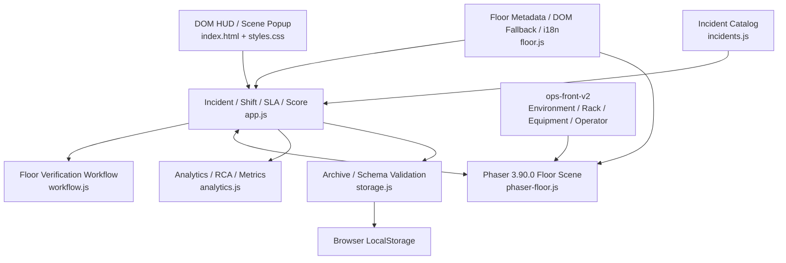
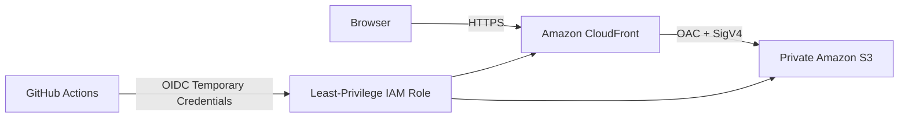

# DC OPS: NIGHT SHIFT

**DC OPS: NIGHT SHIFT**는 데이터센터 운영과 장애 대응 과정을 직접 수행해볼 수 있도록 만든 브라우저 기반 **Data Center Incident Response Simulator**입니다.

사용자는 Night Shift 동안 데이터센터 Floor를 이동하며 장애가 발생한 Rack을 찾고, **Safe Simulated Terminal**에서 Linux 운영 명령을 사용해 Evidence를 수집한 뒤 Root Cause를 진단하고 Recovery Action을 수행합니다.

v1.1 Floor Mode에서는 Recovery Action을 선택했다고 Incident가 즉시 종료되지 않습니다.
Terminal에서 시스템이 정상 상태로 돌아왔는지 **Verification**까지 완료해야 Incident가 최종 Resolve됩니다.

> 이 프로젝트는 교육 및 Portfolio 목적의 Simulation입니다.
> 실제 데이터센터, Linux Shell, Monitoring System 또는 운영 서버에 연결되지 않습니다.

**Live Demo — v1.0 Stable**
https://d35scspd118fhn.cloudfront.net

**Current Development — v1.1 Floor Mode Preview**
Branch: `feature/v1.1-floor-mode`

---

## Core Gameplay

```text
Incident 발생
      ↓
Data Center Floor에서 장애 Rack 탐색
      ↓
E 상호작용
      ↓
Safe Simulated Terminal
      ↓
Evidence 수집
      ↓
Root Cause Diagnosis
      ↓
Recovery Action
      ↓
Verification Pending
      ↓
Terminal에서 정상 상태 확인
      ↓
Verification Passed
      ↓
Incident Resolved
```

단순히 정답 버튼을 선택하는 방식이 아니라, 사용자가 Terminal 명령으로 장애 Evidence를 수집하고 그 결과를 기반으로 장애 원인을 판단하도록 구성했습니다.

---

## Why I Built This

데이터센터 운영 업무에서는 장애를 발견하는 것뿐 아니라 다음과 같은 과정이 중요합니다.

- 장애 우선순위 판단
- 시스템 상태 확인
- Linux / Network 명령을 통한 Evidence 수집
- Root Cause 분석
- Recovery Action 수행
- 복구 후 서비스 정상 여부 확인
- SLA 및 MTTR 기록
- Incident History와 RCA 정리

이 프로젝트는 이러한 Incident Response 흐름을 인터랙티브한 게임 형태로 구현하면서 다음 역량을 보여주는 것을 목표로 했습니다.

- Linux 및 데이터센터 운영 Workflow 이해
- Incident / SLA / Score / Recovery 상태 관리
- Phaser 기반 2D Game Scene 구현
- DOM UI와 Canvas Game Scene 간 상태 연결
- Collision / Interaction / Animation 구현
- Safe Simulated Terminal 설계
- Evidence → Diagnosis → Recovery → Verification Workflow 설계
- LocalStorage 기반 운영 기록 관리
- Automated Regression Test 구성
- Git / GitHub 기반 Feature Branch 개발
- AWS Static Hosting 및 GitHub Actions CI/CD 구성

---

# v1.1 Floor Mode

기존 v1.0은 Dashboard 중심의 Incident Response Simulator였습니다.

v1.1에서는 이를 실제 게임에 가까운 **Scene-first Data Center Floor Mode**로 확장했습니다.

## Data Center Floor

- Phaser `3.90.0`
- Logical World: `1440 × 640`
- Arrow Key 기반 Continuous Movement
- `PLAYER_SPEED = 270`
- Rack / Equipment Collision
- Rack 근접 Interaction
- `E` 키를 통한 Rack Terminal 연결
- Foot Position 기반 Depth Sorting
- Phaser 실패 시 Legacy DOM Fallback
- Desktop 중심 Responsive Scene

현재 Floor에는 다음 설비가 배치됩니다.

```text
R01 ~ R10
UPS
PDU-A
PDU-B
CRAC
Operator
```

현재 Incident Gameplay는 우선 R01~R06 Rack을 중심으로 연결되어 있으며, R07~R10 및 Facility Interaction은 후속 확장 범위입니다.

---

# Game Asset Pipeline

초기 v1.1에서는 3/4 Perspective 형태의 Rack과 Equipment Asset을 사용했습니다.

하지만 Floor Scene의 정면 구도와 시각적으로 맞지 않아 주요 Asset 방향을 다시 설계하고 **Front-facing Visual Pack**으로 교체했습니다.

현재 활성 Visual Pack:

```text
ops-front-v2
```

## Rack

- Normal
- Warning
- Critical

## Equipment

- UPS
- PDU-A
- PDU-B
- CRAC

## Operator

Operator는 4방향 Animation을 사용합니다.

```text
DOWN
UP
LEFT
RIGHT
```

각 방향은 다음 Frame을 가집니다.

- Idle
- Walk Frame 1
- Walk Frame 2
- Walk Frame 3
- Walk Frame 4

모든 Sprite는 동일한 Foot Baseline을 기준으로 정규화했습니다.

Player의 Visual Size와 Collision Footprint를 서로 분리하여, 캐릭터 이미지 전체가 아니라 실제 발 위치를 기준으로 Collision과 Depth를 계산합니다.

Asset 생성 및 정규화 과정은 다음 Script로 재현할 수 있습니다.

```text
scripts/build-ops-front-v2-assets.py
```

---

# Scene-first UI

v1.1 개발 과정에서 기존 Dashboard 형태의 많은 고정 Panel을 제거하고 게임 화면 자체를 최대한 크게 사용하는 구조로 변경했습니다.

제거 또는 축소한 UI:

- Persistent Controls Panel
- Operator Selection
- Persistent Terminal
- Persistent Objectives
- Mini Map
- Bottom Dashboard Row
- Permanent Active Incident Column

대신 필요한 기능을 **Scene Popup** 방식으로 전환했습니다.

현재 주요 Popup:

```text
Terminal
Objectives
Active Incident
Diagnosis
Recovery
```

Popup은 동시에 하나만 열리며 `ESC`로 닫을 수 있습니다.

Popup 종료 후에는 Phaser Scene으로 Focus가 복귀합니다.

---

# Safe Simulated Terminal

Terminal은 실제 Linux Shell이 아닙니다.

사용자가 입력한 명령을 실제 운영체제로 전달하지 않고, Incident Scenario와 연결된 **Simulation Output**을 반환합니다.

지원 명령 예:

```bash
help
top
ps aux
uptime
df -h
ping [host]
curl [url]
nslookup [host]
systemctl status nginx
journalctl -u nginx
ipmitool sensor
```

Incident 종류에 따라 같은 명령도 다른 결과를 반환할 수 있습니다.

예를 들어 서비스 장애 상태에서는:

```text
systemctl status nginx

Active: failed
```

Recovery 이후에는:

```text
systemctl status nginx

Active: active (running)
```

과 같이 Simulated Server State가 변경될 수 있습니다.

Terminal은 Rack별 독립 Session을 유지합니다.

```text
R01 Terminal History
R02 Terminal History
R03 Terminal History
...
```

다른 Rack으로 이동했다 돌아와도 기존 Command / Output History가 유지됩니다.

Terminal 재진입 및 새 Command 실행 시 최신 Output을 보여주도록 Scroll Behavior를 개선했고, 사용자가 직접 위쪽 History를 확인하는 동안에는 일반 UI Update가 Scroll 위치를 강제로 바꾸지 않습니다.

Terminal Input에 Focus가 있을 때 Arrow Key와 `E` 입력은 Player Movement로 전달되지 않습니다.

---

# Evidence System

Incident가 발생하면 사용자는 Terminal Command를 이용해 Evidence를 수집합니다.

예:

```text
EVIDENCE 0 / 2

↓ ipmitool sensor

EVIDENCE 1 / 2

↓ uptime

EVIDENCE 2 / 2
```

필요한 Evidence가 충족되면:

```text
[ 진단하기 ]
```

버튼이 활성화됩니다.

Hard Difficulty에서는 필요한 Evidence를 확보하기 전에는 Diagnosis를 진행할 수 없습니다.

---

# Root Cause Diagnosis

Evidence를 충분히 확보하면 Floor Scene 내부에서 Diagnosis Popup을 열 수 있습니다.

예:

```text
ROOT CAUSE DIAGNOSIS

Rack: R04
Ticket: TKT-0001

Collected Evidence
✓ PSU2 INPUT LOST
✓ REDUNDANCY DEGRADED

Select Root Cause

A. Network Port Blocked
B. Rack PDU Feed A Lost
C. Disk Capacity Exhausted
D. DNS Resolver Failure
```

잘못된 Diagnosis는 기존 Penalty 정책에 따라 Score에 영향을 줄 수 있으며 Incident는 해결되지 않습니다.

올바른 Root Cause를 선택하면 Recovery 단계로 진행합니다.

---

# Recovery Action

Root Cause가 확인되면 기존 Incident Scenario의 Recovery Action을 사용합니다.

예:

```text
RECOVERY ACTION

Confirmed Root Cause
Rack PDU Feed A Lost

A. Restart nginx
B. Restore redundant power feed
C. Flush DNS cache
D. Remove log files
```

기존 v1.0 Dashboard에서는 Recovery 성공 후 기존 방식대로 Incident가 Resolve됩니다.

v1.1 Floor Mode에서는 한 단계가 추가됩니다.

```text
RECOVERY APPLIED
VERIFICATION PENDING
```

즉, Recovery Action을 맞췄다고 Incident가 즉시 끝나지 않습니다.

---

# Recovery Verification

Recovery 이후 사용자는 다시 Terminal에서 시스템이 정상적으로 복구되었는지 확인해야 합니다.

Browser Regression에서 검증한 POWER Incident 예:

```text
Rack:
R04

Incident:
Rack PDU Feed A Lost

Investigation:
ipmitool sensor
uptime

Diagnosis:
Rack PDU Feed A Lost

Recovery:
Restore redundant power feed

Status:
VERIFICATION PENDING
```

관련 없는 Verification Command를 실행하면 Incident는 계속 Pending 상태를 유지합니다.

필수 Verification Command로 정상 상태가 확인되면:

```text
VERIFICATION PASSED

INCIDENT RESOLVED
```

그 후 다음 상태가 갱신됩니다.

- Rack Healthy 복귀
- Active Incident 감소
- Score 반영
- SLA 반영
- MTTR 기록
- Incident History 생성
- Terminal History 유지

---

# Incident System

현재 Incident Catalog는 총 15개의 Scenario를 포함합니다.

| Category | Investigation Area |
| --- | --- |
| `SERVER` | Service, CPU, Memory, Process |
| `STORAGE` | Capacity, I/O, Mount, Filesystem |
| `NETWORK` | Connectivity, DNS, Interface, Packet Path |
| `POWER` | PSU, Voltage, Redundant Power |
| `COOLING` | Temperature, Fan, Airflow |

Difficulty:

```text
EASY
NORMAL
HARD
```

각 Incident는 다음 데이터를 가질 수 있습니다.

- Affected Rack
- Symptom
- Severity
- SLA
- Useful Commands
- Required Evidence
- Diagnosis Options
- Correct Root Cause
- Recovery Options
- Correct Recovery Action
- Verification State
- Event History

---

# Incident Metrics

Shift 동안 다음 지표를 기록합니다.

- Score
- SLA Compliance
- MTTR
- Diagnosis Accuracy
- Investigation Coverage
- Category Performance
- Wrong Diagnosis
- Wrong Recovery Action
- Incident History
- RCA
- Lessons Learned

Shift가 종료되면 결과를 LocalStorage 기반 Archive에 저장할 수 있습니다.

---

# Architecture



Phaser는 이동, Animation, Collision, Depth와 Interaction을 담당합니다.

`app.js`는 Shift, Incident, Terminal, Diagnosis, Recovery, Verification, SLA, Score 등 게임 전체 상태의 Source of Truth 역할을 유지합니다.

`workflow.js`는 Floor Mode의 Recovery Verification 상태 판정을 위한 Helper를 담당합니다.

---

# AWS Deployment Architecture

현재 공개 Production은 **v1.0 Stable**입니다.



AWS는 Application Backend가 아니라 정적 Frontend를 전달하는 Hosting 계층으로만 사용합니다.

Production Deploy는 `main` Branch의 수동 Workflow에서만 수행됩니다.

현재 v1.1 Floor Mode는 Development Branch에서 작업 중이며 아직 Production에 배포하지 않았습니다.

---

# Project Structure

```text
dc-ops-simulator/
│
├── .github/
│   └── workflows/
│       ├── ci.yml
│       └── deploy.yml
│
├── assets/
│   └── v1.1/
│       ├── environment/
│       ├── equipment/
│       ├── operators/
│       ├── racks/
│       ├── source/
│       └── ops-front-v2/
│           ├── equipment/
│           ├── operators/
│           └── racks/
│
├── docs/
│   └── DEPLOYMENT.md
│
├── infra/
│   ├── cloudformation.yml
│   └── github-oidc.yml
│
├── scripts/
│   ├── vendor-phaser.js
│   └── build-ops-front-v2-assets.py
│
├── tests/
│   └── run-tests.js
│
├── vendor/
│   ├── phaser.min.js
│   └── PHASER_LICENSE.md
│
├── analytics.js
├── app.js
├── floor.js
├── incidents.js
├── phaser-floor.js
├── workflow.js
├── storage.js
│
├── index.html
├── styles.css
│
├── package.json
├── package-lock.json
│
├── PROJECT_STATUS.md
├── README.md
└── THIRD_PARTY_NOTICES.md
```

## 주요 파일

| File | Role |
| --- | --- |
| `app.js` | Shift, Incident, SLA, Score, Terminal, Diagnosis, Recovery 및 Phaser Bridge |
| `phaser-floor.js` | Phaser Floor Scene, Movement, Collision, Depth, Interaction |
| `floor.js` | Floor Metadata, DOM Fallback, i18n |
| `workflow.js` | Floor Mode Verification State Helper |
| `incidents.js` | Incident Catalog 및 Validation |
| `analytics.js` | RCA, Metrics, Score, Comparison |
| `storage.js` | LocalStorage Archive 및 Schema Validation |
| `index.html` | Dashboard, Floor HUD 및 Scene Popup Structure |
| `styles.css` | Scene, Popup, Responsive UI |
| `tests/run-tests.js` | Automated Regression Tests |
| `scripts/build-ops-front-v2-assets.py` | ops-front-v2 Asset 생성 및 정규화 |

---

# Automated Testing

Regression Test는 Node.js Built-in Assertion을 중심으로 구성했습니다.

현재 v1.1 Branch:

```text
59 passed
```

주요 검사 대상:

- Incident Catalog Validation
- Difficulty Pool
- Score Rule
- SLA Logic
- Terminal Command Classification
- Evidence Collection
- Diagnosis Workflow
- Recovery Workflow
- Verification Pending State
- Verification Command 판정
- Incident Resolve
- Incident History
- RCA
- LocalStorage Archive
- Floor Metadata
- Phaser Movement Intent
- Collision Metadata
- Player Foot Anchor
- Rack Interaction
- Terminal History
- Dashboard Compatibility
- DOM Fallback

실행:

```bash
npm run check
npm test
```

최근 Floor Mode Regression 결과:

```text
Automated Tests: 59 passed
Browser Console Error: 0
Broken Image: 0
git diff --check: PASS
```

---

# v1.1 Development Highlights

## 1. DOM Floor Prototype

초기 Floor Mode는 HTML / CSS 기반 Grid Movement 구조였습니다.

하지만 이동이 Tile 단위로 끊기고 Visual Depth와 Collision 표현에 한계가 있었습니다.

---

## 2. Phaser Migration

중앙 Floor Scene을 Phaser Canvas로 이전했습니다.

이를 통해 다음 기능을 구현했습니다.

- Held-key Continuous Movement
- Physics Collision
- 4-direction Animation
- Y-depth
- Interaction Distance
- Player Foot Anchor 기반 Collision

기존 Incident / Terminal / Archive 시스템은 JavaScript / DOM 구조를 유지하여 v1.0의 안정된 게임 로직을 최대한 재사용했습니다.

---

## 3. Visual Asset Redesign

초기 Rack과 Equipment Asset은 3/4 Perspective 형태였지만 Floor Scene과 시각적으로 맞지 않았습니다.

이후 주요 설비를 정면 형태의 `ops-front-v2` Asset으로 재구성했습니다.

Operator도 4-direction / 4-frame Walk 구조로 개선했습니다.

Visual Sprite와 Collision Footprint를 별도 Metadata로 관리하여 화면 표현과 Physics를 분리했습니다.

---

## 4. UI Simplification

초기 Floor Mode에는 다음 Panel이 동시에 표시되었습니다.

- Controls
- Operator Selection
- Mini Map
- Persistent Terminal
- Objectives
- Active Incident Column
- Bottom Dashboard

이 구조는 게임 화면을 좁게 만들고 기존 Dashboard와 비슷한 인상을 주었습니다.

이를 개선하기 위해 필요한 기능만 Scene Popup으로 표시하도록 UI를 재설계했습니다.

---

## 5. Full-height Floor Scene

Permanent Incident Column과 Bottom Status 영역을 제거하면서 Floor Scene이 Desktop Viewport 대부분을 사용하도록 변경했습니다.

1920×1080 환경에서 Scene Wrapper를 대폭 확장해 Data Center Floor가 화면의 중심이 되도록 구성했습니다.

Phaser Logical World `1440×640`은 유지하여 기존 Position / Collision Metadata와 Gameplay 좌표는 변경하지 않았습니다.

---

## 6. Terminal Session Improvements

Rack별 Terminal Session을 분리했습니다.

```text
R01 History
R02 History
R03 History
...
```

Rack 이동 후 다시 돌아와도 이전 조사 기록이 유지됩니다.

Terminal Popup Open, Rack 전환, History Restore, 새 Output 이후에는 최신 Output을 보여주도록 Scroll Logic을 개선했습니다.

사용자가 직접 이전 Output을 확인하는 동안에는 일반 UI Update가 Scroll Position을 강제로 변경하지 않습니다.

---

## 7. Scene Popup Architecture

Terminal, Objectives와 Active Incident를 고정 Panel이 아니라 Scene Popup으로 변경했습니다.

이후 같은 Popup Manager에 Diagnosis와 Recovery를 연결해 Floor Mode 전체 Workflow를 한 화면 안에서 처리하도록 확장했습니다.

```text
none
terminal
objectives
incident
diagnosis
recovery
```

Popup 간 상태는 상호 배타적으로 관리합니다.

---

## 8. Complete Incident Response Workflow

Floor Mode 안에서 전체 Incident Response Lifecycle을 완료할 수 있도록 다음 Workflow를 구현했습니다.

```text
Evidence
→ Diagnosis
→ Recovery
→ Verification
→ Resolve
```

이제 사용자가 장애를 해결하기 위해 기존 v1.0 Dashboard로 이동할 필요가 없습니다.

특히 Recovery Action 정답 직후 Incident를 끝내지 않고, Terminal에서 정상 상태를 다시 확인하게 만들어 실제 운영 절차에 가까운 Training Flow를 구성했습니다.

---

# Local Development

별도 Build 과정 없이 정적 파일로 실행할 수 있습니다.

권장:

```bash
python -m http.server 8000
```

브라우저:

```text
http://localhost:8000
```

---

# Tech Stack

## Frontend

- Semantic HTML
- Responsive CSS
- Vanilla JavaScript
- Phaser `3.90.0`

## Data

- Browser LocalStorage

## Testing

- Node.js Built-in Assertion
- Browser Regression Testing

## CI / Deployment

- Git
- GitHub
- GitHub Actions
- AWS CloudFormation
- Amazon S3
- Amazon CloudFront
- Origin Access Control
- GitHub OIDC IAM Role

---

# Simulation Scope

Terminal은 실제 Shell이 아니라 Allowlist 기반 **Safe Simulated Terminal**입니다.

입력한 Command는 운영체제로 전달되지 않습니다.

Simulation에서는 다음과 같은 실제 시스템 기능 전체를 구현하지 않습니다.

- 실제 Process Table
- 실제 DNS Resolver
- 실제 Network Stack
- 실제 Filesystem
- 실제 Permission
- Pipe
- Redirect
- Shell Script
- 전체 Linux Command Option

Terminal Output은 Incident Response Workflow를 학습하기 위한 Simulation Data입니다.

---

# Current Limitations

- 실제 Linux Shell이 아닌 Allowlist 기반 Simulation입니다.
- 실제 데이터센터 Monitoring System과 연결되지 않습니다.
- 실행 중인 Shift는 Browser Refresh 후 복원되지 않습니다.
- Shift Archive는 Browser LocalStorage에 저장됩니다.
- 기기 간 Archive 동기화를 지원하지 않습니다.
- v1.1 Floor Gameplay는 현재 R01~R06 중심으로 연결되어 있습니다.
- R07~R10 Incident Gameplay는 아직 확장 예정입니다.
- UPS / PDU / CRAC Facility Scenario는 아직 확장 예정입니다.
- Verification은 현재 기존 Incident Evidence 정보를 이용해 최소 검증 조건을 생성합니다.
- Incident별 명시적인 다중 Verification Rule은 후속 개선 범위입니다.
- Mobile Viewport 적합성은 유지하지만 Touch Movement UI는 아직 구현하지 않았습니다.
- Phaser Logical World의 Aspect Ratio 때문에 세로 비율이 큰 Viewport에서는 Letterboxing이 발생할 수 있습니다.
- v1.1은 아직 Production Release가 아닌 Preview 상태입니다.

---

# Next Steps

v1.1 후속 개발 범위:

- Incident별 명시적 Verification Command 정의
- R07~R10 Incident Gameplay 확장
- UPS / PDU / CRAC Facility Interaction
- Terminal Command Simulation 확대
- Environment Visual Polish
- Lighting / Shadow Polish
- Incident별 Verification Result 다양화
- Mobile Touch Interaction 검토
- 전체 v1.1 Regression
- README / Project Status / Development Log 지속 관리
- `feature/v1.1-floor-mode → main` Pull Request
- v1.1 Production Release

---

# Version Status

```text
Production
└─ v1.0 Stable

Development
└─ v1.1 Floor Mode Preview

Branch
└─ feature/v1.1-floor-mode
```

---

# Version History

- `v0.7` — Expanded Incident Catalog & Category System
- `v0.8` — Incident History & RCA Analytics System
- `v0.9` — Persistent Shift Archive & Operations Records
- `v0.10` — Production Readiness & Portfolio Polish
- `v1.0` — AWS Deployment & Portfolio Release
- `v1.1` — Phaser-based Data Center Floor Mode, in development

---

# License / Third-party

Phaser `3.90.0`은 MIT License를 따릅니다.

관련 License와 Attribution은 다음 파일에서 확인할 수 있습니다.

```text
vendor/PHASER_LICENSE.md
THIRD_PARTY_NOTICES.md
```

본 프로젝트의 Data Center UI, Game Logic과 Project-specific Asset은 Portfolio 및 학습 목적으로 제작되었습니다.

---

상세 구현 상태와 Known Issues는 [`PROJECT_STATUS.md`](PROJECT_STATUS.md)에서 확인할 수 있습니다.
