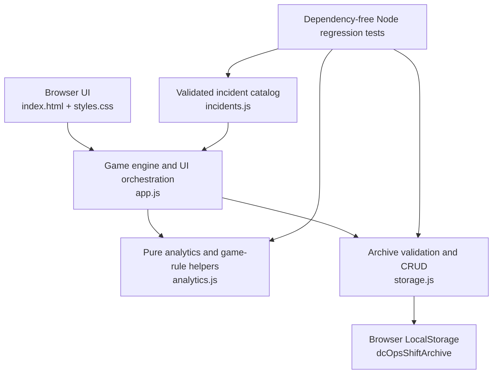

# DC OPS: NIGHT SHIFT

**DC OPS: NIGHT SHIFT**는 데이터센터 운영과 장애 대응 흐름을 학습하기 위한 브라우저 기반 **Incident Response Simulator**입니다.

제한된 시간의 Night Shift 동안 Rack에서 발생한 Incident를 조사하고, Evidence를 확보해 Diagnosis와 Recovery를 수행합니다. Shift 종료 후에는 SLA, MTTR, RCA와 운영 기록을 확인할 수 있습니다.

이 프로젝트는 교육 및 Portfolio 목적의 Simulation입니다. 실제 데이터센터 인프라나 Monitoring System에 연결되지 않으며, 실제 Linux Shell 명령을 실행하지 않습니다.

## 프로젝트 개요 (Overview)

데이터센터 운영에서 사용하는 Incident Response 흐름을 짧고 반복 가능한 브라우저 경험으로 구성했습니다.

1. Easy, Normal, Hard 중 Difficulty를 선택하고 Shift를 시작합니다.
2. 수동 또는 자동으로 생성된 Incident를 Queue에서 확인합니다.
3. 장애가 발생한 Rack을 선택하고 Safe Simulated Terminal로 조사합니다.
4. 수집한 Evidence를 바탕으로 Diagnosis와 Recovery Action을 결정합니다.
5. SLA가 만료되기 전에 Incident를 복구합니다.
6. Incident History, Timeline, RCA, Category Analytics와 Shift Archive를 확인합니다.

## 제작 목적 (Why I Built This)

데이터센터 장애 대응은 단순히 문제를 해결하는 것뿐 아니라 우선순위 판단, Evidence 수집, 제한 시간 관리와 사후 분석을 함께 요구합니다.

이 프로젝트는 그 흐름을 하나의 Frontend 애플리케이션으로 구현하면서 다음 역량을 보여주기 위해 제작했습니다.

- Incident 상태와 사용자 Action을 연결하는 게임 로직 설계
- SLA, MTTR, Accuracy 등 운영 지표 계산
- RCA와 Shift 기록을 위한 데이터 구조 설계
- LocalStorage 기반 영속성, schema validation과 오류 처리
- 자동 테스트와 GitHub Actions CI 구성
- 접근성과 Responsive UI를 고려한 Vanilla JavaScript 개발

실제 인프라 동작을 재현하기보다는 Incident Response의 절차와 데이터 흐름을 명확하게 학습하는 데 초점을 맞췄습니다.

## Core Workflow

```text
Incident → Investigation → Evidence → Diagnosis → Recovery
        → SLA / MTTR → Incident History / RCA → Shift Archive
```

Hard Mode에서는 필요한 수의 유효한 Evidence를 확보해야 Diagnosis가 활성화됩니다. Easy와 Normal에서는 Investigation이 선택 사항이지만, 실행한 command와 유효·무효 조사 기록은 동일하게 집계됩니다.

## 주요 기능 (Features)

- 검증된 Incident Scenario 15종
- `SERVER`, `STORAGE`, `NETWORK`, `POWER`, `COOLING` 5개 Category
- Easy / Normal / Hard Difficulty System
- Priority 기반 Incident Queue와 Ticket별 SLA Timer
- Incident별 Evidence를 제공하는 Allowlist 기반 Simulated Terminal
- Hard Mode Investigation Evidence Gate
- Diagnosis와 Recovery Action 선택 및 penalty 처리
- Difficulty별 Recovery Reward와 최저 0점 Score 정책
- Terminal Evidence, Timeline, RCA, Lessons Learned를 포함한 Incident History
- SLA Compliance, MTTR, Accuracy, Investigation Coverage, Category Performance 분석
- LocalStorage 기반 Shift Archive, Filter, Previous Shift Comparison, Personal Best
- Archive Record 개별 삭제와 전체 삭제
- 외부 dependency 없이 실행되는 automated regression test
- GitHub Actions 기반 syntax check와 CI
- Desktop과 mobile breakpoint를 고려한 Responsive 구조

> 정확한 375px Device Emulation은 현재 v0.10에서 완료된 것으로 간주하지 않습니다. Responsive CSS 구조는 구현되어 있으며, v1.0 공개 배포 후 실제 hosted 환경에서 다시 검증할 예정입니다.

## Incident Categories

| Category | 주요 조사 범위 |
| --- | --- |
| `SERVER` | Service, CPU, memory, process 상태 |
| `STORAGE` | Capacity, I/O, mount, filesystem 증상 |
| `NETWORK` | Connectivity, DNS, interface, packet path 증상 |
| `POWER` | PSU, voltage, redundant power 증상 |
| `COOLING` | Temperature, airflow, fan, cooling 증상 |

## Architecture



현재 버전에는 Backend, Database Server, AWS Service 또는 실제 Shell 연결이 없습니다. 모든 게임 상태와 UI 제어는 브라우저 내부에서 처리되며, 완료된 Shift Record만 LocalStorage에 저장됩니다.

## Project Structure

```text
dc-ops-simulator/
├── .github/
│   └── workflows/
│       ├── ci.yml
│       └── deploy.yml
├── docs/
│   └── DEPLOYMENT.md
├── infra/
│   ├── cloudformation.yml
│   └── github-oidc.yml
├── tests/
│   └── run-tests.js
├── .gitattributes
├── .gitignore
├── analytics.js
├── app.js
├── incidents.js
├── index.html
├── package.json
├── PROJECT_STATUS.md
├── README.md
├── storage.js
└── styles.css
```

| 파일 | 역할 |
| --- | --- |
| `index.html` | Dashboard, Terminal, History, Archive, Shift Report UI 구조 |
| `styles.css` | Dark NOC Style, 상태 표현, Modal과 Responsive Layout |
| `app.js` | Shift 진행, Incident 대응, Terminal과 전체 UI orchestration |
| `incidents.js` | 15종 Incident Catalog와 데이터 validation |
| `analytics.js` | RCA, Shift Analytics, Score rule, Comparison과 Personal Best 계산 |
| `storage.js` | LocalStorage schema validation과 Shift Archive CRUD |
| `tests/run-tests.js` | Node.js built-in module 기반 automated regression test |
| `.github/workflows/ci.yml` | Push와 Pull Request에서 syntax check와 test 실행 |
| `.github/workflows/deploy.yml` | test 통과 후 OIDC로 AWS에 수동 배포하는 Workflow |
| `infra/cloudformation.yml` | Private S3, CloudFront와 OAC를 정의한 hosting template |
| `infra/github-oidc.yml` | GitHub OIDC Provider와 최소 권한 deploy Role template |
| `docs/DEPLOYMENT.md` | bootstrap, 배포, rollback, cleanup과 비용 안내 |
| `PROJECT_STATUS.md` | 현재 Version, Known Issues와 검증 결과 기록 |

## Testing

Test Runner는 Node.js built-in module만 사용하므로 별도의 package 설치가 필요하지 않습니다. 현재 **36 automated checks**가 Catalog, 게임 규칙, Analytics, RCA와 Archive regression을 검증합니다.

```bash
npm test
npm run check
```

- `npm test`: 36개 automated checks 실행
- `npm run check`: `app.js`, `incidents.js`, `analytics.js`, `storage.js`, `tests/run-tests.js` syntax 검사

GitHub Actions는 `main` push와 Pull Request에서 두 명령을 자동으로 실행합니다. 현재 CI는 Ubuntu Runner와 **Node.js 24 LTS**를 사용하며, 외부 dependency 설치나 배포 단계는 포함하지 않습니다.

별도의 AWS Deploy Workflow는 v1.0 준비 파일로 제공됩니다. `main`의 수동 실행만 허용하며, 같은 syntax check와 36개 test가 모두 성공한 뒤에만 OIDC 임시 credential로 정적 파일을 배포하도록 구성되어 있습니다. AWS Resource는 아직 생성되지 않았으며 자세한 bootstrap 절차는 [`docs/DEPLOYMENT.md`](docs/DEPLOYMENT.md)를 참고합니다.

주요 테스트 범위:

- Incident Catalog와 Difficulty Pool
- Score multiplier와 최저 0점 정책
- Terminal command 분류와 full-rack warning deduplication
- RCA와 Investigation Coverage
- LocalStorage schema와 손상 데이터 fallback
- Shift Snapshot, Archive CRUD와 최대 50개 제한
- Previous Shift Comparison과 Personal Best

## 로컬 실행 (Run Locally)

Build 과정 없이 `index.html`을 직접 열어 실행할 수 있습니다. 다만 LocalStorage와 브라우저 보안 정책을 일관되게 확인하려면 localhost에서 실행하는 방식을 권장합니다.

```bash
python -m http.server 8000
```

브라우저에서 다음 주소를 엽니다.

```text
http://localhost:8000
```

일반적인 Desktop Browser에서는 `file://` 방식으로도 실행할 수 있지만, local file의 LocalStorage 동작은 Browser와 privacy policy에 따라 달라질 수 있습니다. Archive는 현재 Browser Profile과 Origin에만 저장됩니다.

## Tech Stack

- Semantic HTML
- Responsive CSS
- Vanilla JavaScript
- Browser LocalStorage
- Node.js built-in modules
- GitHub Actions

## Simulation Scope

Terminal은 실제 Shell이 아니라 고정된 Allowlist를 사용하는 **Safe Simulated Terminal**입니다.

지원하는 조사 명령 예시:

```text
top
df -h
ping [host]
curl [url]
nslookup [host]
systemctl status nginx
journalctl -u nginx
ipmitool sensor
```

입력한 command는 운영체제로 전달되지 않으며, Incident Scenario와 연결된 안전한 Simulation Output만 반환합니다. Target을 받는 명령은 입력한 target을 표시하지만 실제 DNS Resolver, Network Stack, Process Table, Permission, Pipe, Redirect 또는 전체 Shell Option을 구현하지 않습니다.

따라서 Terminal Evidence는 실제 서버 진단 결과가 아니라 Investigation Workflow를 학습하기 위한 데이터입니다.

## 현재 제한 사항 (Current Limitations)

- 실행 중인 Shift는 페이지 새로고침 후 복구되지 않습니다.
- Shift Archive는 하나의 Browser Profile과 Origin에 저장되며 기기 간 동기화되지 않습니다.
- Storage schema v1 validation은 있지만 실제 migration runner는 없습니다.
- Archive import/export와 cloud sync를 지원하지 않습니다.
- Archive pagination, 검색, 장기 trend chart가 없습니다.
- Background Tab에서는 화면 갱신 timer가 일시 중지될 수 있습니다. 경과 시간 계산은 `Date.now()`를 기준으로 합니다.
- Incident 간격, SLA, penalty와 grade는 추가 playtest를 통해 조정할 여지가 있습니다.
- Responsive 구조는 구현되어 있지만 정확한 375px Device Emulation은 v1.0 공개 배포 후 다시 검증할 예정입니다.

## Roadmap

### v1.0 — AWS Deployment & Portfolio Release

- Private S3 + CloudFront + OAC 기반 Static Hosting 구성
- HTTPS, cache, 기본 오류 응답과 rollback 절차 문서화
- 공개 URL에서 Desktop/Mobile Smoke Test
- 정확한 375px Device Emulation 재검증
- README Screenshot과 간단한 Operator Walkthrough 추가
- CI 성공 이후에만 배포하는 Workflow 검토

현재 저장소에는 CloudFormation과 GitHub OIDC 배포 준비 파일만 추가되어 있습니다. 실제 AWS Resource 생성, 공개 URL 등록, v1.0 Version 표시는 별도 승인과 공개 환경 검증이 끝난 뒤 진행합니다.

향후 실제 Ubuntu 또는 EC2 Lab을 진행하더라도 이 Browser Simulation과는 별도 환경과 문서로 구분할 예정입니다.

## Version History

- `v0.7` — Expanded Incident Catalog & Category System
- `v0.8` — Incident History & RCA Analytics System
- `v0.9` — Persistent Shift Archive & Operations Records
- `v0.10` — Production Readiness & Portfolio Polish

상세 구현 상태와 Known Issues, 검증 결과는 [`PROJECT_STATUS.md`](PROJECT_STATUS.md)에서 확인할 수 있습니다.
