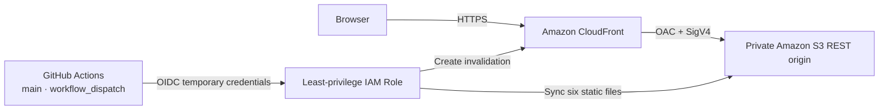

# AWS Deployment Guide

이 문서는 **DC OPS: NIGHT SHIFT** v1.0의 AWS 배포 구조와 재현 가능한 운영 절차를 설명한다. 애플리케이션은 Backend가 없는 Static Frontend다.

현재 Production 배포는 Seoul Region(`ap-northeast-2`)의 Private S3와 CloudFront OAC 구조로 운영된다. Application Stack은 `dc-ops-night-shift-prod`, OIDC Stack은 `dc-ops-github-oidc`다. Account ID, Role ARN, Bucket 이름과 Distribution ID는 source에 기록하지 않고 CloudFormation Output과 GitHub `production` Environment variable로 전달한다.

## Architecture



- CloudFront가 공개 HTTPS endpoint를 제공한다.
- S3 Bucket은 Static Website Hosting을 사용하지 않는 private REST origin이다.
- Origin Access Control(OAC)이 CloudFront의 origin request를 서명한다.
- S3 Bucket Policy는 생성된 CloudFront Distribution의 `s3:GetObject`만 허용한다.
- GitHub Actions는 장기 access key 대신 GitHub OIDC로 발급받은 임시 credential을 사용한다.

## 생성 대상 Resource

`infra/cloudformation.yml`:

- Amazon S3 Bucket 1개
- CloudFront Distribution 1개
- CloudFront Origin Access Control 1개
- CloudFront Cache Policy 1개
- S3 Bucket Policy 1개

`infra/github-oidc.yml`:

- GitHub OIDC Provider 0~1개: AWS Account에 이미 있으면 재사용
- 배포용 IAM Role과 inline least-privilege policy 1개

Lambda, API Gateway, DynamoDB, EC2, RDS, NAT Gateway, Load Balancer, Elastic IP, WAF, Route 53, custom domain, ACM certificate는 이 범위에 포함하지 않는다.

## 사전 준비와 승인 경계

실제 생성 전 다음 항목을 확인한다.

1. AWS CLI v2 설치
2. 사용할 AWS Account로 인증
3. `aws configure get region`으로 Region 확인
4. Region이 없으면 Seoul Region인 `ap-northeast-2` 제안 후 확정
5. 전 세계에서 고유한 소문자 S3 Bucket 이름 결정
6. `aws sts get-caller-identity` 결과의 Account를 화면에서 확인하되 문서나 commit에 기록하지 않음
7. 아래 CloudFormation 실행 계획에 대해 명시적으로 승인

AWS CLI 설치와 인증이 끝나기 전에는 아래 AWS command를 실행할 수 없다.

## Template Validation

AWS CLI 설치와 인증 후 Resource를 생성하지 않는 다음 command로 main template을 검증한다.

```powershell
aws cloudformation validate-template `
  --template-body file://infra/cloudformation.yml `
  --region ap-northeast-2

aws cloudformation validate-template `
  --template-body file://infra/github-oidc.yml `
  --region ap-northeast-2
```

`validate-template`은 template을 검사하지만 Stack을 생성하지 않는다. `ap-northeast-2`는 예시이며 실제 확정 Region으로 교체한다.

## Bootstrap 1: Hosting Stack

아래 command는 실제 AWS Resource를 생성한다. 사전 승인을 받은 뒤에만 실행한다.

```powershell
$DcOpsRegion = "ap-northeast-2"
$DcOpsBucketName = "replace-with-a-globally-unique-bucket-name"

aws cloudformation deploy `
  --template-file infra/cloudformation.yml `
  --stack-name dc-ops-night-shift-prod `
  --parameter-overrides DcOpsBucketName=$DcOpsBucketName `
  --region $DcOpsRegion `
  --no-fail-on-empty-changeset
```

생성이 끝나면 output을 확인한다.

```powershell
aws cloudformation describe-stacks `
  --stack-name dc-ops-night-shift-prod `
  --region $DcOpsRegion `
  --query "Stacks[0].Outputs"
```

`BucketName`, `DistributionId`, `DistributionDomainName`, `PublicUrl`을 이후 단계에 사용한다. 실제 CloudFront URL이 생성되기 전에는 임의의 Live Demo URL을 문서에 넣지 않는다.

## Bootstrap 2: GitHub OIDC와 IAM

먼저 Account에 GitHub OIDC Provider가 있는지 읽기 전용으로 확인한다.

```powershell
aws iam list-open-id-connect-providers
```

이미 `token.actions.githubusercontent.com` Provider가 있으면 ARN을 `ExistingGitHubOidcProviderArn`에 전달한다. 없다면 이 parameter의 기본값을 사용해 Stack이 Provider를 하나 생성하게 한다.

CloudFormation Template은 Account의 Provider를 자동 탐지하지 않는다. 기존 Provider가 있는데 parameter를 비워 두면 중복 생성 시도로 Stack이 실패할 수 있으므로, 조회 결과에 따라 아래 두 경우 중 하나를 명시적으로 선택한다.

공통 parameter:

```powershell
$DcOpsBucketName = "hosting-stack-BucketName-output"
$DcOpsDistributionId = "hosting-stack-DistributionId-output"
```

기존 GitHub OIDC Provider를 재사용하는 경우:

```powershell
$ExistingGitHubProviderArn = "existing-provider-arn-from-read-only-query"

aws cloudformation deploy `
  --template-file infra/github-oidc.yml `
  --stack-name dc-ops-github-oidc `
  --parameter-overrides `
    ContentBucketName=$DcOpsBucketName `
    DistributionId=$DcOpsDistributionId `
    ExistingGitHubOidcProviderArn=$ExistingGitHubProviderArn `
    GitHubOidcSubject=repo:dbtjddn10-oss@302221967/dc-ops-simulator@1326726431:environment:production `
  --capabilities CAPABILITY_IAM `
  --region $DcOpsRegion `
  --no-fail-on-empty-changeset
```

GitHub OIDC Provider가 없어 신규 생성하는 경우에는 `ExistingGitHubOidcProviderArn` override를 생략한다.

```powershell
aws cloudformation deploy `
  --template-file infra/github-oidc.yml `
  --stack-name dc-ops-github-oidc `
  --parameter-overrides `
    ContentBucketName=$DcOpsBucketName `
    DistributionId=$DcOpsDistributionId `
    GitHubOidcSubject=repo:dbtjddn10-oss@302221967/dc-ops-simulator@1326726431:environment:production `
  --capabilities CAPABILITY_IAM `
  --region $DcOpsRegion `
  --no-fail-on-empty-changeset
```

Trust Policy는 immutable owner/repository ID와 `production` environment가 모두 일치할 때만 `sts:AssumeRoleWithWebIdentity`를 허용한다. Condition은 wildcard 없는 exact `StringEquals`다. GitHub Environment의 deployment branch rule은 `main`으로 제한하고, Workflow도 `main`이 아니면 job을 실행하지 않는다. IAM permission은 대상 Bucket의 list/get/put/delete와 대상 Distribution의 `CreateInvalidation`으로 제한한다.

이 Repository는 2026-07-15 이후 생성되어 GitHub의 immutable OIDC subject 형식을 사용한다. Repository를 복제해 별도 배포할 때는 GitHub API에서 실제 owner/repository ID 기반 `sub`를 확인한 뒤 exact value로 교체하며 wildcard subject는 사용하지 않는다.

## GitHub Actions 설정

GitHub Repository의 `Settings → Environments`에서 `production` environment를 만들고 deployment branch를 `main`으로 제한한다. 현재 이 Environment와 `main` branch rule이 구성되어 있다. 필요하면 required reviewer를 지정해 수동 승인 단계를 추가한다.

`Settings → Environments → production → Environment variables`에 다음 변수를 등록한다.

| Variable | 값 |
| --- | --- |
| `AWS_REGION` | 확정한 Region, 예: `ap-northeast-2` |
| `AWS_DEPLOY_ROLE_ARN` | OIDC Stack의 `DeployRoleArn` output |
| `S3_BUCKET_NAME` | Hosting Stack의 `BucketName` output |
| `CLOUDFRONT_DISTRIBUTION_ID` | Hosting Stack의 `DistributionId` output |
| `CLOUDFRONT_DOMAIN_NAME` | Hosting Stack의 `DistributionDomainName` output, `https://` 제외 |

AWS access key, secret access key, session token은 등록하지 않는다. Workflow에는 `contents: read`, `id-token: write`만 부여되어 있다.

`.github/workflows/deploy.yml`은 자동 push 배포가 아니라 `workflow_dispatch` 수동 실행만 지원한다. `main`에서 다음 순서로 수행한다.

1. JavaScript syntax check
2. 36 automated checks
3. GitHub OIDC를 통한 임시 AWS credential 발급
4. 실행에 필요한 6개 정적 파일만 S3에 sync
5. CloudFront `/*` invalidation 요청
6. 공개 endpoint Smoke Test

## Manual Deployment

Workflow 문제를 분리해 확인해야 할 때만 로컬 수동 배포를 사용한다. 먼저 `npm run check`와 `npm test`가 성공해야 한다.

```powershell
npm run check
npm test

$DcOpsBucketName = "hosting-stack-BucketName-output"
$DcOpsDistributionId = "hosting-stack-DistributionId-output"
$DcOpsArtifact = Join-Path $env:TEMP "dc-ops-site"

New-Item -ItemType Directory -Force -Path $DcOpsArtifact | Out-Null
Copy-Item index.html, styles.css, app.js, incidents.js, analytics.js, storage.js $DcOpsArtifact

aws s3 sync $DcOpsArtifact "s3://$DcOpsBucketName" `
  --delete `
  --exclude "index.html" `
  --cache-control "public,max-age=300,must-revalidate"

aws s3 cp "$DcOpsArtifact/index.html" "s3://$DcOpsBucketName/index.html" `
  --cache-control "no-cache,max-age=0,must-revalidate" `
  --content-type "text/html; charset=utf-8"

aws cloudfront create-invalidation `
  --distribution-id $DcOpsDistributionId `
  --paths "/*"
```

Resource ID는 repository 파일에 hardcode하지 않는다. 수동 배포의 shell variable이나 GitHub Variables, CloudFormation output으로만 전달한다.

## Cache와 Invalidation

현재 파일명에는 content hash가 없으므로 장기 immutable cache를 사용하지 않는다.

- `index.html`: `no-cache,max-age=0,must-revalidate`
- JavaScript와 CSS: `public,max-age=300,must-revalidate`
- CloudFront Cache Policy: minimum 0초, default 300초, maximum 3600초
- 배포 후: `/*` invalidation 요청

존재하지 않는 path는 S3 REST origin의 기본 403/404 응답을 그대로 사용한다. SPA용 404 → `index.html` rewrite는 구성하지 않는다.

Invalidation은 AWS의 무료 허용량을 초과하면 비용이 발생할 수 있다.

## Smoke Test

CloudFront 배포와 invalidation이 완료된 후 공개 URL에서 확인한다.

```powershell
$DcOpsPublicUrl = "https://distribution-domain-name"
curl.exe --fail --location $DcOpsPublicUrl
curl.exe --head $DcOpsPublicUrl
```

추가 검증 항목:

- HTTP 요청이 HTTPS로 redirect되는지 확인
- S3 REST URL로 object를 직접 요청했을 때 public access가 거부되는지 확인
- `index.html`, CSS, JavaScript가 정상 로드되는지 확인
- Browser console error가 없는지 확인
- Desktop core workflow Smoke Test
- 정확한 375px Device Emulation에서 layout과 modal 검증
- LocalStorage Shift Archive가 동일 Origin에서 정상 동작하는지 확인

## Rollback

애플리케이션 rollback은 Git history의 마지막 정상 commit을 임시 worktree 또는 별도 clone에 checkout한 뒤, 동일한 6개 정적 파일을 다시 sync하고 `/*` invalidation을 요청한다. `git reset --hard`나 force push는 사용하지 않는다.

Infrastructure 변경은 CloudFormation change set과 Stack event를 먼저 확인한다. 실패한 update는 CloudFormation rollback 상태를 확인하고, 필요하면 마지막 정상 template로 일반 update를 수행한다.

## Cleanup

Cleanup은 배포 검증과 별개의 파괴적 작업이므로 별도 승인을 받은 뒤 실행한다.

1. GitHub Actions 배포를 중지하고 관련 Variables를 제거한다.
2. OIDC Stack을 삭제해 deploy Role을 제거한다.
3. OIDC Provider를 이 Stack이 생성했고 다른 Repository가 사용하지 않는지 확인한다.
4. S3 Bucket 안의 object를 비운다.
5. Hosting Stack을 삭제한다. CloudFront Distribution 비활성화와 삭제에는 시간이 걸릴 수 있다.

```powershell
aws s3 rm "s3://bucket-name" --recursive
aws cloudformation delete-stack --stack-name dc-ops-github-oidc --region $DcOpsRegion
aws cloudformation delete-stack --stack-name dc-ops-night-shift-prod --region $DcOpsRegion
```

위 command는 실제 데이터를 삭제하므로 이 문서 작성 단계에서는 실행하지 않는다.

## 비용 확인

이 구성은 낮은 트래픽의 Static Portfolio를 전제로 하지만 비용이 항상 0원이라고 보장하지 않는다.

- S3 저장 용량, PUT/GET/LIST/DELETE 요청
- CloudFront HTTPS 요청과 Data Transfer
- 무료 허용량을 초과한 invalidation path
- 배포와 Smoke Test가 만드는 요청
- 로그나 별도 유료 기능을 나중에 추가할 경우 발생하는 추가 비용

AWS Pricing과 Free Tier 적용 여부는 Account, Region, 사용량, 시점에 따라 달라질 수 있다. 배포 전 AWS Pricing Calculator와 Billing Budget/Alarm 설정을 별도로 검토한다.

- [Amazon S3 Pricing](https://aws.amazon.com/s3/pricing/)
- [Amazon CloudFront Pricing](https://aws.amazon.com/cloudfront/pricing/)
- [CloudFront invalidation 비용 안내](https://docs.aws.amazon.com/AmazonCloudFront/latest/DeveloperGuide/PayingForInvalidation.html)

## Security Checklist

- S3 Block Public Access 네 항목 유지
- S3 Website Endpoint와 public ACL 미사용
- OAC `SigningBehavior: always`, SigV4 사용
- Bucket Policy가 해당 CloudFront Distribution의 read만 허용하는지 확인
- Viewer Protocol Policy가 `redirect-to-https`인지 확인
- GitHub OIDC trust가 정확한 Repository의 `production` environment로 제한되고, Environment deployment branch가 `main`인지 확인
- IAM Role에 Admin, wildcard resource, 불필요한 CloudFormation permission이 없는지 확인
- credential, Account ID, 실제 ARN, Bucket 이름을 commit하지 않음
- custom domain, ACM, WAF 등은 별도 요구와 승인 전에는 추가하지 않음
